# Project Structure

## Directory Map

```mermaid
flowchart TD
    ROOT["/"]
    ROOT --> MAIN["main/"]
    ROOT --> UTILS["utils/"]
    ROOT --> CLI["cli_interface/"]
    ROOT --> TESTS["tests/"]
    ROOT --> SCRIPTS["scripts/"]
    ROOT --> DOCS["docs/"]
    ROOT --> CURSOR[".cursor/"]
    ROOT --> ROO[".roo/"]
    ROOT --> CLINERULES[".clinerules/"]
    ROOT --> GITHUB[".github/"]
    ROOT --> learning_adaptation["learning_adaptation.py"]
    ROOT --> pasted_content["pasted_content.txt"]
    ROOT --> supabase_schema["supabase_learning_schema.sql"]
    ROOT --> usage_examples["usage_examples.py"]
    ROOT --> requirements["requirements.txt"]
    ROOT --> root_init["__init__.py"]
    MAIN --> coding_director["coding_director.py"]
    MAIN --> config_manager["config_manager.py"]
    MAIN --> enhanced_cli["enhanced_cli.py"]
    MAIN --> knowledge_feedback["knowledge_feedback.py"]
    MAIN --> learning_orchestrator["learning_orchestrator.py"]
    MAIN --> model_manager["model_manager.py"]
    MAIN --> database_manager["database_manager.py"]
    MAIN --> conversation_memory["conversation_memory.py"]
    MAIN --> supabase_learning_client["supabase_learning_client.py"]
    MAIN --> main_init["__init__.py"]
    UTILS --> local_llm_client["local_llm_client.py"]
    UTILS --> utils_init["__init__.py"]
    CLI --> cli["cli.py"]
    CLI --> cli_init["__init__.py"]
    TESTS --> tests_init["__init__.py"]
    SCRIPTS --> enhanced_setup["enhanced_setup.sh"]
    SCRIPTS --> setup["setup.sh"]
    DOCS --> GUIDES["guides/"]
    GUIDES --> amd_vs_nvidia["AMD vs NVIDIA and Platform Performance Research.md"]
    GUIDES --> architecture_research["architecture_research.md"]
    GUIDES --> quick_start["Elite Coding Assistant - Quick Start Guide.md"]
    GUIDES --> elite_coding_assistant["Elite Coding Assistant.md"]
    GUIDES --> guide_md["elite_coding_assistant_guide.md"]
    GUIDES --> guide_pdf["elite_coding_assistant_guide.pdf"]
    GUIDES --> learning_architecture["Enhanced Elite Coding Assistant - Learning Architecture.md"]
    GUIDES --> enhanced_docs_md["enhanced_learning_system_docs.md"]
    GUIDES --> enhanced_docs_pdf["enhanced_learning_system_docs.pdf"]
    GUIDES --> enhanced_todo["enhanced_todo.md"]
    GUIDES --> model_analysis["model_analysis.md"]
    GUIDES --> pydantic_ai_research["pydantic_ai_research.md"]
```

## File & Directory Descriptions

### Root Files
- **learning_adaptation.py**: Core logic for adaptive learning and model orchestration.
- **pasted_content.txt**: Temporary or reference content pasted for development.
- **supabase_learning_schema.sql**: SQL schema for Supabase learning database tables.
- **usage_examples.py**: Example scripts demonstrating usage of core modules.
- **requirements.txt**: Python dependencies for the project.
- **__init__.py**: Marks the root as a Python package (empty).

### main/
- **coding_director.py**: High-level orchestration and routing logic for the coding assistant.
- **config_manager.py**: Handles configuration loading, validation, and management.
- **enhanced_cli.py**: Enhanced command-line interface for user interaction.
- **knowledge_feedback.py**: Manages feedback ingestion and knowledge updates.
- **learning_orchestrator.py**: Coordinates learning cycles and agent orchestration.
- **model_manager.py**: Handles model selection, loading, and management.
- **database_manager.py**: Unified async database interface with Supabase, SQLite, and in-memory backends.
- **conversation_memory.py**: Advanced conversation/session memory agent and persistence logic.
- **supabase_learning_client.py**: Integration with Supabase for persistent learning data and analytics.
- **__init__.py**: Marks the main module as a package.

### utils/
- **local_llm_client.py**: Client for interacting with local LLMs or OpenAI APIs.
- **__init__.py**: Marks the utils module as a package.

### cli_interface/
- **cli.py**: Command-line interface entry point.
- **__init__.py**: Marks the cli_interface module as a package.

### tests/
- **__init__.py**: Marks the tests module as a package (add test files here).

### scripts/
- **enhanced_setup.sh**: Advanced setup script for environment and dependencies.
- **setup.sh**: Basic setup script for initial project configuration.

### docs/guides/
- **AMD vs NVIDIA and Platform Performance Research.md**: Research notes on hardware and platform performance.
- **architecture_research.md**: Research and notes on system architecture.
- **Elite Coding Assistant - Quick Start Guide.md**: Quick start instructions for users.
- **Elite Coding Assistant.md**: Main product documentation.
- **elite_coding_assistant_guide.md**: Comprehensive user and developer guide (Markdown).
- **elite_coding_assistant_guide.pdf**: PDF version of the main guide.
- **Enhanced Elite Coding Assistant - Learning Architecture.md**: Documentation on the learning architecture.
- **enhanced_learning_system_docs.md**: Extended documentation for the enhanced system.
- **enhanced_learning_system_docs.pdf**: PDF version of the enhanced system docs.
- **enhanced_todo.md**: Project todo list and task breakdown.
- **model_analysis.md**: Analysis and comparison of different models.
- **pydantic_ai_research.md**: Research and notes on Pydantic AI integration. 