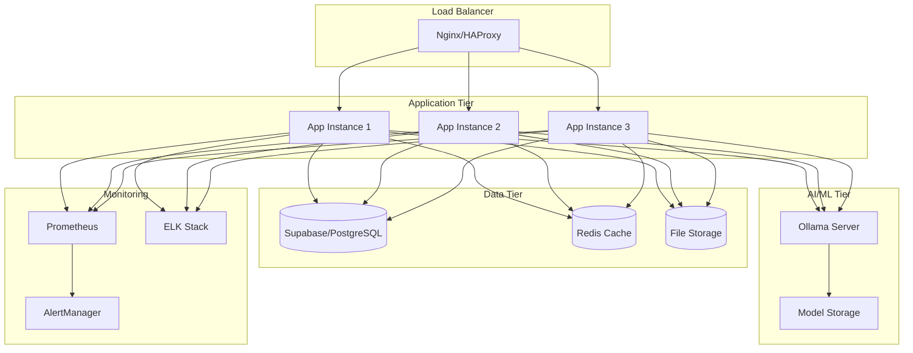
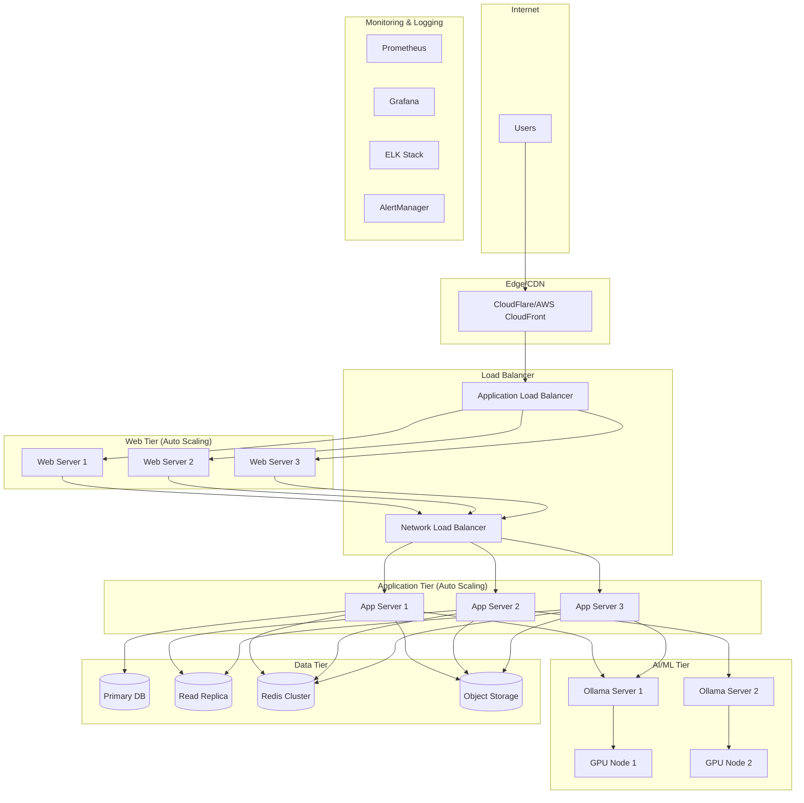

# Elite Coding Assistant - Deployment Guide

**Version**: 2.0  
**Date**: December 2024  
**Target Audience**: DevOps Engineers, System Administrators  

## 📋 Table of Contents

1. [Overview](#overview)
2. [Prerequisites](#prerequisites)
3. [Local Development Setup](#local-development-setup)
4. [Docker Deployment](#docker-deployment)
5. [Production Deployment](#production-deployment)
6. [Cloud Deployment](#cloud-deployment)
7. [Configuration Management](#configuration-management)
8. [Monitoring and Logging](#monitoring-and-logging)
9. [Backup and Recovery](#backup-and-recovery)
10. [Security Hardening](#security-hardening)
11. [Scaling and Load Balancing](#scaling-and-load-balancing)
12. [Troubleshooting](#troubleshooting)

## 🎯 Overview

The Elite Coding Assistant can be deployed in various environments:

- **Local Development**: Single-machine setup for development
- **Docker**: Containerized deployment for consistency
- **Production**: High-availability production environment
- **Cloud**: AWS, GCP, Azure deployments
- **Kubernetes**: Container orchestration for scale

### Architecture Overview



## 🔧 Prerequisites

### System Requirements

#### Minimum Requirements
- **CPU**: 4 cores (8 recommended)
- **RAM**: 8GB (16GB recommended)
- **Storage**: 50GB SSD (100GB recommended)
- **Network**: 1Gbps connection

#### Recommended Production Requirements
- **CPU**: 8+ cores
- **RAM**: 32GB+
- **Storage**: 200GB+ NVMe SSD
- **Network**: 10Gbps connection
- **GPU**: NVIDIA GPU with 8GB+ VRAM (for local AI models)

### Software Dependencies

```bash
# Operating System
Ubuntu 22.04 LTS (recommended)
CentOS 8+
Debian 11+
Windows Server 2019+

# Core Dependencies
Python 3.11+
Node.js 18+
Docker 24.0+
Docker Compose 2.0+
Nginx 1.24+
Redis 7.0+
PostgreSQL 15+ (or Supabase)

# AI/ML Dependencies
Ollama (latest)
CUDA 12.0+ (for GPU support)
NVIDIA Container Toolkit (for Docker GPU)
```

### Network Requirements

```yaml
Ports:
  - 80: HTTP (redirect to HTTPS)
  - 443: HTTPS (main application)
  - 8000: Application server (internal)
  - 6379: Redis (internal)
  - 5432: PostgreSQL (internal)
  - 11434: Ollama API (internal)
  - 9090: Prometheus (monitoring)
  - 3000: Grafana (monitoring)

Firewall Rules:
  - Allow inbound: 80, 443
  - Allow internal: 8000, 6379, 5432, 11434
  - Allow monitoring: 9090, 3000 (restricted)
  - Block all other inbound traffic
```

## 🏠 Local Development Setup

### Quick Start

```bash
# 1. Clone the repository
git clone https://github.com/your-org/elite-coding-assistant.git
cd elite-coding-assistant

# 2. Install Python dependencies
python -m venv venv
source venv/bin/activate  # On Windows: venv\Scripts\activate
pip install -r requirements.txt

# 3. Install and start Redis
# macOS
brew install redis
brew services start redis

# Ubuntu/Debian
sudo apt-get install redis-server
sudo systemctl start redis-server

# Windows
# Download and install Redis from https://redis.io/download

# 4. Install and start Ollama
curl -fsSL https://ollama.ai/install.sh | sh
ollama serve &

# Pull required models
ollama pull llama2
ollama pull codellama
ollama pull mistral

# 5. Set up environment variables
cp .env.example .env
# Edit .env with your configuration

# 6. Initialize database
python scripts/init_database.py

# 7. Start the application
python main/main.py
```

### Development Environment Configuration

#### `.env` file for development
```bash
# Environment
ENVIRONMENT=development
DEBUG=true
LOG_LEVEL=DEBUG
SECRET_KEY=dev-secret-key-change-in-production

# Database (use local PostgreSQL or Supabase)
SUPABASE_URL=https://your-project.supabase.co
SUPABASE_KEY=your-supabase-anon-key
SUPABASE_SERVICE_KEY=your-supabase-service-key

# Redis
REDIS_URL=redis://localhost:6379
REDIS_DB=0

# AI Models
OLLAMA_BASE_URL=http://localhost:11434
OPENAI_API_KEY=your-openai-key-optional

# Development settings
CORS_ORIGINS=http://localhost:3000,http://localhost:8080
ALLOWED_HOSTS=localhost,127.0.0.1
RELOAD=true
WORKERS=1
```

#### Development Scripts

```bash
# scripts/dev-setup.sh
#!/bin/bash
set -e

echo "Setting up Elite Coding Assistant development environment..."

# Check Python version
python_version=$(python3 --version | cut -d" " -f2 | cut -d"." -f1,2)
if [[ "$python_version" < "3.11" ]]; then
    echo "Error: Python 3.11+ required, found $python_version"
    exit 1
fi

# Create virtual environment
if [ ! -d "venv" ]; then
    python3 -m venv venv
fi

source venv/bin/activate

# Install dependencies
pip install --upgrade pip
pip install -r requirements.txt
pip install -r requirements-dev.txt

# Install pre-commit hooks
pre-commit install

# Check if Redis is running
if ! redis-cli ping > /dev/null 2>&1; then
    echo "Starting Redis..."
    redis-server --daemonize yes
fi

# Check if Ollama is running
if ! curl -s http://localhost:11434/api/tags > /dev/null; then
    echo "Starting Ollama..."
    ollama serve &
    sleep 5
fi

# Pull required models
echo "Pulling AI models..."
ollama pull llama2
ollama pull codellama

# Initialize database
if [ ! -f ".db_initialized" ]; then
    echo "Initializing database..."
    python scripts/init_database.py
    touch .db_initialized
fi

echo "Development environment ready!"
echo "Run 'python main/main.py' to start the application"
```

### IDE Configuration

#### VS Code Settings (`.vscode/settings.json`)
```json
{
    "python.defaultInterpreterPath": "./venv/bin/python",
    "python.linting.enabled": true,
    "python.linting.pylintEnabled": true,
    "python.linting.flake8Enabled": true,
    "python.formatting.provider": "black",
    "python.formatting.blackArgs": ["--line-length=88"],
    "python.sortImports.args": ["--profile", "black"],
    "editor.formatOnSave": true,
    "editor.codeActionsOnSave": {
        "source.organizeImports": true
    },
    "files.exclude": {
        "**/__pycache__": true,
        "**/*.pyc": true,
        ".pytest_cache": true,
        ".coverage": true,
        "htmlcov": true
    }
}
```

## 🐳 Docker Deployment

### Single Container Development

#### Dockerfile
```dockerfile
# Dockerfile
FROM python:3.11-slim

# Set environment variables
ENV PYTHONDONTWRITEBYTECODE=1 \
    PYTHONUNBUFFERED=1 \
    PIP_NO_CACHE_DIR=1 \
    PIP_DISABLE_PIP_VERSION_CHECK=1

# Install system dependencies
RUN apt-get update && apt-get install -y \
    build-essential \
    curl \
    git \
    && rm -rf /var/lib/apt/lists/*

# Create app directory
WORKDIR /app

# Install Python dependencies
COPY requirements.txt .
RUN pip install --no-cache-dir -r requirements.txt

# Copy application code
COPY . .

# Create non-root user
RUN useradd -m -u 1000 appuser && chown -R appuser:appuser /app
USER appuser

# Expose port
EXPOSE 8000

# Health check
HEALTHCHECK --interval=30s --timeout=10s --start-period=5s --retries=3 \
    CMD curl -f http://localhost:8000/health || exit 1

# Start application
CMD ["python", "main/main.py"]
```

#### Build and Run
```bash
# Build image
docker build -t elite-coding-assistant:latest .

# Run container
docker run -d \
    --name elite-coding-assistant \
    -p 8000:8000 \
    -e ENVIRONMENT=development \
    -e SUPABASE_URL=your-supabase-url \
    -e SUPABASE_KEY=your-supabase-key \
    -e REDIS_URL=redis://host.docker.internal:6379 \
    -v $(pwd)/data:/app/data \
    -v $(pwd)/logs:/app/logs \
    elite-coding-assistant:latest
```

### Multi-Container with Docker Compose

#### docker-compose.yml
```yaml
version: '3.8'

services:
  app:
    build: .
    container_name: elite-coding-assistant
    ports:
      - "8000:8000"
    environment:
      - ENVIRONMENT=production
      - SUPABASE_URL=${SUPABASE_URL}
      - SUPABASE_KEY=${SUPABASE_KEY}
      - REDIS_URL=redis://redis:6379
      - OLLAMA_BASE_URL=http://ollama:11434
    depends_on:
      - redis
      - ollama
    volumes:
      - ./data:/app/data
      - ./logs:/app/logs
      - ./config:/app/config
    restart: unless-stopped
    healthcheck:
      test: ["CMD", "curl", "-f", "http://localhost:8000/health"]
      interval: 30s
      timeout: 10s
      retries: 3
      start_period: 40s

  redis:
    image: redis:7-alpine
    container_name: elite-redis
    ports:
      - "6379:6379"
    volumes:
      - redis_data:/data
      - ./config/redis.conf:/usr/local/etc/redis/redis.conf
    command: redis-server /usr/local/etc/redis/redis.conf
    restart: unless-stopped
    healthcheck:
      test: ["CMD", "redis-cli", "ping"]
      interval: 10s
      timeout: 5s
      retries: 3

  ollama:
    image: ollama/ollama:latest
    container_name: elite-ollama
    ports:
      - "11434:11434"
    volumes:
      - ollama_data:/root/.ollama
    environment:
      - OLLAMA_HOST=0.0.0.0
    restart: unless-stopped
    # Uncomment for GPU support
    # deploy:
    #   resources:
    #     reservations:
    #       devices:
    #         - driver: nvidia
    #           count: 1
    #           capabilities: [gpu]

  nginx:
    image: nginx:alpine
    container_name: elite-nginx
    ports:
      - "80:80"
      - "443:443"
    volumes:
      - ./config/nginx.conf:/etc/nginx/nginx.conf
      - ./ssl:/etc/nginx/ssl
      - ./static:/var/www/static
    depends_on:
      - app
    restart: unless-stopped

  # Monitoring
  prometheus:
    image: prom/prometheus:latest
    container_name: elite-prometheus
    ports:
      - "9090:9090"
    volumes:
      - ./config/prometheus.yml:/etc/prometheus/prometheus.yml
      - prometheus_data:/prometheus
    command:
      - '--config.file=/etc/prometheus/prometheus.yml'
      - '--storage.tsdb.path=/prometheus'
      - '--web.console.libraries=/etc/prometheus/console_libraries'
      - '--web.console.templates=/etc/prometheus/consoles'
    restart: unless-stopped

  grafana:
    image: grafana/grafana:latest
    container_name: elite-grafana
    ports:
      - "3000:3000"
    environment:
      - GF_SECURITY_ADMIN_PASSWORD=admin123
    volumes:
      - grafana_data:/var/lib/grafana
      - ./config/grafana:/etc/grafana/provisioning
    restart: unless-stopped

volumes:
  redis_data:
  ollama_data:
  prometheus_data:
  grafana_data:

networks:
  default:
    name: elite-network
```

#### Docker Compose Commands
```bash
# Start all services
docker-compose up -d

# View logs
docker-compose logs -f app

# Scale application
docker-compose up -d --scale app=3

# Update services
docker-compose pull
docker-compose up -d

# Stop all services
docker-compose down

# Clean up
docker-compose down -v --remove-orphans
```

### GPU Support for Docker

#### Install NVIDIA Container Toolkit
```bash
# Ubuntu/Debian
curl -fsSL https://nvidia.github.io/libnvidia-container/gpgkey | sudo gpg --dearmor -o /usr/share/keyrings/nvidia-container-toolkit-keyring.gpg
curl -s -L https://nvidia.github.io/libnvidia-container/stable/deb/nvidia-container-toolkit.list | \
    sed 's#deb https://#deb [signed-by=/usr/share/keyrings/nvidia-container-toolkit-keyring.gpg] https://#g' | \
    sudo tee /etc/apt/sources.list.d/nvidia-container-toolkit.list

sudo apt-get update
sudo apt-get install -y nvidia-container-toolkit
sudo nvidia-ctk runtime configure --runtime=docker
sudo systemctl restart docker
```

#### GPU-enabled Docker Compose
```yaml
# Add to ollama service in docker-compose.yml
ollama:
  image: ollama/ollama:latest
  deploy:
    resources:
      reservations:
        devices:
          - driver: nvidia
            count: 1
            capabilities: [gpu]
  environment:
    - NVIDIA_VISIBLE_DEVICES=all
```

## 🏭 Production Deployment

### Production Architecture



### Production Environment Setup

#### System Preparation
```bash
#!/bin/bash
# scripts/production-setup.sh

set -e

echo "Setting up production environment..."

# Update system
sudo apt-get update && sudo apt-get upgrade -y

# Install essential packages
sudo apt-get install -y \
    curl \
    wget \
    git \
    htop \
    iotop \
    netstat-nat \
    tcpdump \
    strace \
    lsof \
    tree \
    jq \
    unzip

# Install Docker
curl -fsSL https://get.docker.com -o get-docker.sh
sudo sh get-docker.sh
sudo usermod -aG docker $USER

# Install Docker Compose
sudo curl -L "https://github.com/docker/compose/releases/latest/download/docker-compose-$(uname -s)-$(uname -m)" -o /usr/local/bin/docker-compose
sudo chmod +x /usr/local/bin/docker-compose

# Configure system limits
sudo tee -a /etc/security/limits.conf << EOF
* soft nofile 65536
* hard nofile 65536
* soft nproc 32768
* hard nproc 32768
EOF

# Configure kernel parameters
sudo tee -a /etc/sysctl.conf << EOF
# Network optimizations
net.core.rmem_max = 134217728
net.core.wmem_max = 134217728
net.ipv4.tcp_rmem = 4096 65536 134217728
net.ipv4.tcp_wmem = 4096 65536 134217728
net.core.netdev_max_backlog = 5000
net.ipv4.tcp_congestion_control = bbr

# Memory optimizations
vm.swappiness = 10
vm.dirty_ratio = 15
vm.dirty_background_ratio = 5
EOF

sudo sysctl -p

# Create application user
sudo useradd -m -s /bin/bash elite
sudo usermod -aG docker elite

# Create directory structure
sudo mkdir -p /opt/elite-coding-assistant/{app,data,logs,config,ssl}
sudo chown -R elite:elite /opt/elite-coding-assistant

echo "Production environment setup complete!"
```

#### Production Configuration

```bash
# /opt/elite-coding-assistant/config/.env.production
ENVIRONMENT=production
DEBUG=false
LOG_LEVEL=INFO
SECRET_KEY=your-super-secure-secret-key

# Database
SUPABASE_URL=https://your-production-project.supabase.co
SUPABASE_KEY=your-production-supabase-key
SUPABASE_SERVICE_KEY=your-production-service-key

# Redis Cluster
REDIS_URL=redis://redis-cluster:6379
REDIS_PASSWORD=your-redis-password
REDIS_CLUSTER_NODES=redis1:6379,redis2:6379,redis3:6379

# AI Models
OLLAMA_BASE_URL=http://ollama-cluster:11434
OPENAI_API_KEY=your-openai-production-key

# Security
CORS_ORIGINS=https://yourdomain.com,https://app.yourdomain.com
ALLOWED_HOSTS=yourdomain.com,app.yourdomain.com
SSL_VERIFY=true
SECURE_COOKIES=true
HTTPS_ONLY=true

# Performance
WORKERS=8
MAX_CONNECTIONS=1000
REQUEST_TIMEOUT=30
KEEP_ALIVE_TIMEOUT=5

# Monitoring
PROMETHEUS_ENABLED=true
METRICS_PORT=9090
HEALTH_CHECK_INTERVAL=30

# Logging
LOG_FORMAT=json
LOG_ROTATION=daily
LOG_RETENTION_DAYS=30
```

### High Availability Setup

#### Load Balancer Configuration (Nginx)
```nginx
# /opt/elite-coding-assistant/config/nginx.conf
user nginx;
worker_processes auto;
error_log /var/log/nginx/error.log warn;
pid /var/run/nginx.pid;

events {
    worker_connections 4096;
    use epoll;
    multi_accept on;
}

http {
    include /etc/nginx/mime.types;
    default_type application/octet-stream;
    
    # Logging
    log_format main '$remote_addr - $remote_user [$time_local] "$request" '
                    '$status $body_bytes_sent "$http_referer" '
                    '"$http_user_agent" "$http_x_forwarded_for" '
                    'rt=$request_time uct="$upstream_connect_time" '
                    'uht="$upstream_header_time" urt="$upstream_response_time"';
    
    access_log /var/log/nginx/access.log main;
    
    # Performance optimizations
    sendfile on;
    tcp_nopush on;
    tcp_nodelay on;
    keepalive_timeout 65;
    types_hash_max_size 2048;
    client_max_body_size 100M;
    
    # Gzip compression
    gzip on;
    gzip_vary on;
    gzip_min_length 1024;
    gzip_types text/plain text/css text/xml text/javascript
               application/javascript application/xml+rss
               application/json application/xml;
    
    # Rate limiting
    limit_req_zone $binary_remote_addr zone=api:10m rate=10r/s;
    limit_req_zone $binary_remote_addr zone=login:10m rate=1r/s;
    
    # Upstream servers
    upstream app_servers {
        least_conn;
        server app1:8000 max_fails=3 fail_timeout=30s;
        server app2:8000 max_fails=3 fail_timeout=30s;
        server app3:8000 max_fails=3 fail_timeout=30s;
        keepalive 32;
    }
    
    # SSL configuration
    ssl_protocols TLSv1.2 TLSv1.3;
    ssl_ciphers ECDHE-RSA-AES256-GCM-SHA512:DHE-RSA-AES256-GCM-SHA512:ECDHE-RSA-AES256-GCM-SHA384:DHE-RSA-AES256-GCM-SHA384;
    ssl_prefer_server_ciphers off;
    ssl_session_cache shared:SSL:10m;
    ssl_session_timeout 10m;
    
    # Security headers
    add_header X-Frame-Options DENY;
    add_header X-Content-Type-Options nosniff;
    add_header X-XSS-Protection "1; mode=block";
    add_header Strict-Transport-Security "max-age=31536000; includeSubDomains" always;
    
    # Main server block
    server {
        listen 80;
        server_name yourdomain.com www.yourdomain.com;
        return 301 https://$server_name$request_uri;
    }
    
    server {
        listen 443 ssl http2;
        server_name yourdomain.com www.yourdomain.com;
        
        ssl_certificate /etc/nginx/ssl/cert.pem;
        ssl_certificate_key /etc/nginx/ssl/key.pem;
        
        # API endpoints
        location /api/ {
            limit_req zone=api burst=20 nodelay;
            
            proxy_pass http://app_servers;
            proxy_set_header Host $host;
            proxy_set_header X-Real-IP $remote_addr;
            proxy_set_header X-Forwarded-For $proxy_add_x_forwarded_for;
            proxy_set_header X-Forwarded-Proto $scheme;
            
            proxy_connect_timeout 5s;
            proxy_send_timeout 30s;
            proxy_read_timeout 30s;
            
            proxy_buffering on;
            proxy_buffer_size 4k;
            proxy_buffers 8 4k;
        }
        
        # WebSocket endpoints
        location /ws/ {
            proxy_pass http://app_servers;
            proxy_http_version 1.1;
            proxy_set_header Upgrade $http_upgrade;
            proxy_set_header Connection "upgrade";
            proxy_set_header Host $host;
            proxy_set_header X-Real-IP $remote_addr;
            proxy_set_header X-Forwarded-For $proxy_add_x_forwarded_for;
            proxy_set_header X-Forwarded-Proto $scheme;
            
            proxy_read_timeout 86400;
        }
        
        # Static files
        location /static/ {
            alias /var/www/static/;
            expires 1y;
            add_header Cache-Control "public, immutable";
        }
        
        # Health check
        location /health {
            access_log off;
            proxy_pass http://app_servers;
        }
        
        # Login rate limiting
        location /api/auth/login {
            limit_req zone=login burst=5 nodelay;
            proxy_pass http://app_servers;
        }
    }
}
```

#### Database High Availability

```yaml
# PostgreSQL with replication
version: '3.8'

services:
  postgres-primary:
    image: postgres:15
    environment:
      POSTGRES_DB: elite_coding_assistant
      POSTGRES_USER: postgres
      POSTGRES_PASSWORD: ${DB_PASSWORD}
      POSTGRES_REPLICATION_USER: replicator
      POSTGRES_REPLICATION_PASSWORD: ${REPLICATION_PASSWORD}
    volumes:
      - postgres_primary_data:/var/lib/postgresql/data
      - ./config/postgresql-primary.conf:/etc/postgresql/postgresql.conf
      - ./config/pg_hba.conf:/etc/postgresql/pg_hba.conf
    command: postgres -c config_file=/etc/postgresql/postgresql.conf
    ports:
      - "5432:5432"
    networks:
      - db_network

  postgres-replica:
    image: postgres:15
    environment:
      POSTGRES_DB: elite_coding_assistant
      POSTGRES_USER: postgres
      POSTGRES_PASSWORD: ${DB_PASSWORD}
      PGUSER: postgres
      POSTGRES_PRIMARY_HOST: postgres-primary
      POSTGRES_REPLICATION_USER: replicator
      POSTGRES_REPLICATION_PASSWORD: ${REPLICATION_PASSWORD}
    volumes:
      - postgres_replica_data:/var/lib/postgresql/data
      - ./config/postgresql-replica.conf:/etc/postgresql/postgresql.conf
    command: |
      bash -c '
      until pg_isready -h postgres-primary -p 5432; do
        echo "Waiting for primary database..."
        sleep 2
      done
      
      if [ ! -f /var/lib/postgresql/data/PG_VERSION ]; then
        pg_basebackup -h postgres-primary -D /var/lib/postgresql/data -U replicator -v -P -W
        echo "standby_mode = on" >> /var/lib/postgresql/data/recovery.conf
        echo "primary_conninfo = host=postgres-primary port=5432 user=replicator" >> /var/lib/postgresql/data/recovery.conf
      fi
      
      postgres -c config_file=/etc/postgresql/postgresql.conf
      '
    depends_on:
      - postgres-primary
    ports:
      - "5433:5432"
    networks:
      - db_network

volumes:
  postgres_primary_data:
  postgres_replica_data:

networks:
  db_network:
    driver: bridge
```

#### Redis Cluster Setup

```yaml
# Redis Cluster
version: '3.8'

services:
  redis-node-1:
    image: redis:7-alpine
    command: redis-server /etc/redis/redis.conf
    volumes:
      - ./config/redis-cluster.conf:/etc/redis/redis.conf
      - redis_node_1_data:/data
    ports:
      - "7001:7001"
      - "17001:17001"
    environment:
      - REDIS_PORT=7001
    networks:
      - redis_network

  redis-node-2:
    image: redis:7-alpine
    command: redis-server /etc/redis/redis.conf
    volumes:
      - ./config/redis-cluster.conf:/etc/redis/redis.conf
      - redis_node_2_data:/data
    ports:
      - "7002:7002"
      - "17002:17002"
    environment:
      - REDIS_PORT=7002
    networks:
      - redis_network

  redis-node-3:
    image: redis:7-alpine
    command: redis-server /etc/redis/redis.conf
    volumes:
      - ./config/redis-cluster.conf:/etc/redis/redis.conf
      - redis_node_3_data:/data
    ports:
      - "7003:7003"
      - "17003:17003"
    environment:
      - REDIS_PORT=7003
    networks:
      - redis_network

  redis-cluster-init:
    image: redis:7-alpine
    command: |
      sh -c '
      sleep 10
      redis-cli --cluster create \
        redis-node-1:7001 \
        redis-node-2:7002 \
        redis-node-3:7003 \
        --cluster-replicas 0 \
        --cluster-yes
      '
    depends_on:
      - redis-node-1
      - redis-node-2
      - redis-node-3
    networks:
      - redis_network

volumes:
  redis_node_1_data:
  redis_node_2_data:
  redis_node_3_data:

networks:
  redis_network:
    driver: bridge
```

## ☁️ Cloud Deployment

### AWS Deployment

#### Infrastructure as Code (Terraform)

```hcl
# infrastructure/aws/main.tf
provider "aws" {
  region = var.aws_region
}

# VPC and Networking
resource "aws_vpc" "main" {
  cidr_block           = "10.0.0.0/16"
  enable_dns_hostnames = true
  enable_dns_support   = true
  
  tags = {
    Name = "elite-coding-assistant-vpc"
  }
}

resource "aws_subnet" "public" {
  count             = 2
  vpc_id            = aws_vpc.main.id
  cidr_block        = "10.0.${count.index + 1}.0/24"
  availability_zone = data.aws_availability_zones.available.names[count.index]
  
  map_public_ip_on_launch = true
  
  tags = {
    Name = "elite-public-subnet-${count.index + 1}"
  }
}

resource "aws_subnet" "private" {
  count             = 2
  vpc_id            = aws_vpc.main.id
  cidr_block        = "10.0.${count.index + 10}.0/24"
  availability_zone = data.aws_availability_zones.available.names[count.index]
  
  tags = {
    Name = "elite-private-subnet-${count.index + 1}"
  }
}

# Internet Gateway
resource "aws_internet_gateway" "main" {
  vpc_id = aws_vpc.main.id
  
  tags = {
    Name = "elite-igw"
  }
}

# Application Load Balancer
resource "aws_lb" "main" {
  name               = "elite-coding-assistant-alb"
  internal           = false
  load_balancer_type = "application"
  security_groups    = [aws_security_group.alb.id]
  subnets            = aws_subnet.public[*].id
  
  enable_deletion_protection = false
  
  tags = {
    Name = "elite-coding-assistant-alb"
  }
}

# ECS Cluster
resource "aws_ecs_cluster" "main" {
  name = "elite-coding-assistant"
  
  setting {
    name  = "containerInsights"
    value = "enabled"
  }
  
  tags = {
    Name = "elite-coding-assistant-cluster"
  }
}

# ECS Task Definition
resource "aws_ecs_task_definition" "app" {
  family                   = "elite-coding-assistant"
  network_mode             = "awsvpc"
  requires_compatibilities = ["FARGATE"]
  cpu                      = "2048"
  memory                   = "4096"
  execution_role_arn       = aws_iam_role.ecs_execution_role.arn
  task_role_arn           = aws_iam_role.ecs_task_role.arn
  
  container_definitions = jsonencode([
    {
      name  = "elite-coding-assistant"
      image = "${aws_ecr_repository.app.repository_url}:latest"
      
      portMappings = [
        {
          containerPort = 8000
          protocol      = "tcp"
        }
      ]
      
      environment = [
        {
          name  = "ENVIRONMENT"
          value = "production"
        },
        {
          name  = "REDIS_URL"
          value = "redis://${aws_elasticache_replication_group.main.primary_endpoint_address}:6379"
        }
      ]
      
      secrets = [
        {
          name      = "SUPABASE_URL"
          valueFrom = aws_ssm_parameter.supabase_url.arn
        },
        {
          name      = "SUPABASE_KEY"
          valueFrom = aws_ssm_parameter.supabase_key.arn
        }
      ]
      
      logConfiguration = {
        logDriver = "awslogs"
        options = {
          "awslogs-group"         = aws_cloudwatch_log_group.app.name
          "awslogs-region"        = var.aws_region
          "awslogs-stream-prefix" = "ecs"
        }
      }
      
      healthCheck = {
        command     = ["CMD-SHELL", "curl -f http://localhost:8000/health || exit 1"]
        interval    = 30
        timeout     = 5
        retries     = 3
        startPeriod = 60
      }
    }
  ])
}

# ECS Service
resource "aws_ecs_service" "app" {
  name            = "elite-coding-assistant"
  cluster         = aws_ecs_cluster.main.id
  task_definition = aws_ecs_task_definition.app.arn
  desired_count   = 3
  launch_type     = "FARGATE"
  
  network_configuration {
    security_groups  = [aws_security_group.ecs_tasks.id]
    subnets          = aws_subnet.private[*].id
    assign_public_ip = false
  }
  
  load_balancer {
    target_group_arn = aws_lb_target_group.app.arn
    container_name   = "elite-coding-assistant"
    container_port   = 8000
  }
  
  depends_on = [aws_lb_listener.app]
  
  tags = {
    Name = "elite-coding-assistant-service"
  }
}

# ElastiCache Redis
resource "aws_elasticache_replication_group" "main" {
  replication_group_id         = "elite-redis"
  description                  = "Redis cluster for Elite Coding Assistant"
  
  node_type                    = "cache.r6g.large"
  port                         = 6379
  parameter_group_name         = "default.redis7"
  
  num_cache_clusters           = 3
  automatic_failover_enabled   = true
  multi_az_enabled            = true
  
  subnet_group_name = aws_elasticache_subnet_group.main.name
  security_group_ids = [aws_security_group.redis.id]
  
  at_rest_encryption_enabled = true
  transit_encryption_enabled = true
  
  tags = {
    Name = "elite-redis-cluster"
  }
}

# RDS PostgreSQL (if not using Supabase)
resource "aws_db_instance" "main" {
  count = var.use_rds ? 1 : 0
  
  identifier = "elite-coding-assistant-db"
  
  engine         = "postgres"
  engine_version = "15.4"
  instance_class = "db.r6g.large"
  
  allocated_storage     = 100
  max_allocated_storage = 1000
  storage_type          = "gp3"
  storage_encrypted     = true
  
  db_name  = "elite_coding_assistant"
  username = "postgres"
  password = var.db_password
  
  vpc_security_group_ids = [aws_security_group.rds.id]
  db_subnet_group_name   = aws_db_subnet_group.main.name
  
  backup_retention_period = 7
  backup_window          = "03:00-04:00"
  maintenance_window     = "sun:04:00-sun:05:00"
  
  skip_final_snapshot = false
  final_snapshot_identifier = "elite-db-final-snapshot-${formatdate("YYYY-MM-DD-hhmm", timestamp())}"
  
  tags = {
    Name = "elite-coding-assistant-db"
  }
}

# Auto Scaling
resource "aws_appautoscaling_target" "ecs_target" {
  max_capacity       = 10
  min_capacity       = 2
  resource_id        = "service/${aws_ecs_cluster.main.name}/${aws_ecs_service.app.name}"
  scalable_dimension = "ecs:service:DesiredCount"
  service_namespace  = "ecs"
}

resource "aws_appautoscaling_policy" "ecs_policy_cpu" {
  name               = "elite-cpu-scaling"
  policy_type        = "TargetTrackingScaling"
  resource_id        = aws_appautoscaling_target.ecs_target.resource_id
  scalable_dimension = aws_appautoscaling_target.ecs_target.scalable_dimension
  service_namespace  = aws_appautoscaling_target.ecs_target.service_namespace
  
  target_tracking_scaling_policy_configuration {
    predefined_metric_specification {
      predefined_metric_type = "ECSServiceAverageCPUUtilization"
    }
    target_value = 70.0
  }
}
```

#### AWS Deployment Script

```bash
#!/bin/bash
# scripts/deploy-aws.sh

set -e

echo "Deploying Elite Coding Assistant to AWS..."

# Variables
REGION=${AWS_REGION:-us-west-2}
CLUSTER_NAME="elite-coding-assistant"
SERVICE_NAME="elite-coding-assistant"
IMAGE_TAG=${IMAGE_TAG:-latest}

# Build and push Docker image
echo "Building Docker image..."
docker build -t elite-coding-assistant:$IMAGE_TAG .

# Get ECR login token
echo "Logging in to ECR..."
aws ecr get-login-password --region $REGION | docker login --username AWS --password-stdin $ECR_REPOSITORY_URI

# Tag and push image
echo "Pushing image to ECR..."
docker tag elite-coding-assistant:$IMAGE_TAG $ECR_REPOSITORY_URI:$IMAGE_TAG
docker push $ECR_REPOSITORY_URI:$IMAGE_TAG

# Deploy infrastructure with Terraform
echo "Deploying infrastructure..."
cd infrastructure/aws
terraform init
terraform plan -var="image_tag=$IMAGE_TAG"
terraform apply -auto-approve -var="image_tag=$IMAGE_TAG"

# Update ECS service
echo "Updating ECS service..."
aws ecs update-service \
    --cluster $CLUSTER_NAME \
    --service $SERVICE_NAME \
    --force-new-deployment \
    --region $REGION

# Wait for deployment to complete
echo "Waiting for deployment to complete..."
aws ecs wait services-stable \
    --cluster $CLUSTER_NAME \
    --services $SERVICE_NAME \
    --region $REGION

echo "Deployment completed successfully!"

# Get load balancer URL
LB_URL=$(aws elbv2 describe-load-balancers \
    --names elite-coding-assistant-alb \
    --query 'LoadBalancers[0].DNSName' \
    --output text \
    --region $REGION)

echo "Application is available at: https://$LB_URL"
```

### Google Cloud Platform (GCP) Deployment

#### GKE Deployment

```yaml
# k8s/gcp/deployment.yaml
apiVersion: apps/v1
kind: Deployment
metadata:
  name: elite-coding-assistant
  labels:
    app: elite-coding-assistant
spec:
  replicas: 3
  selector:
    matchLabels:
      app: elite-coding-assistant
  template:
    metadata:
      labels:
        app: elite-coding-assistant
    spec:
      containers:
      - name: app
        image: gcr.io/your-project/elite-coding-assistant:latest
        ports:
        - containerPort: 8000
        env:
        - name: ENVIRONMENT
          value: "production"
        - name: REDIS_URL
          value: "redis://redis-service:6379"
        - name: SUPABASE_URL
          valueFrom:
            secretKeyRef:
              name: app-secrets
              key: supabase-url
        - name: SUPABASE_KEY
          valueFrom:
            secretKeyRef:
              name: app-secrets
              key: supabase-key
        resources:
          requests:
            memory: "2Gi"
            cpu: "1000m"
          limits:
            memory: "4Gi"
            cpu: "2000m"
        livenessProbe:
          httpGet:
            path: /health
            port: 8000
          initialDelaySeconds: 30
          periodSeconds: 10
        readinessProbe:
          httpGet:
            path: /ready
            port: 8000
          initialDelaySeconds: 5
          periodSeconds: 5
---
apiVersion: v1
kind: Service
metadata:
  name: elite-coding-assistant-service
spec:
  selector:
    app: elite-coding-assistant
  ports:
  - protocol: TCP
    port: 80
    targetPort: 8000
  type: LoadBalancer
```

### Azure Deployment

#### Azure Container Instances

```yaml
# azure/container-group.yaml
apiVersion: 2021-03-01
location: East US
name: elite-coding-assistant
properties:
  containers:
  - name: elite-coding-assistant
    properties:
      image: your-registry.azurecr.io/elite-coding-assistant:latest
      resources:
        requests:
          cpu: 2
          memoryInGb: 4
      ports:
      - port: 8000
        protocol: TCP
      environmentVariables:
      - name: ENVIRONMENT
        value: production
      - name: REDIS_URL
        secureValue: redis://your-redis-instance:6379
      - name: SUPABASE_URL
        secureValue: https://your-project.supabase.co
      - name: SUPABASE_KEY
        secureValue: your-supabase-key
  osType: Linux
  restartPolicy: Always
  ipAddress:
    type: Public
    ports:
    - protocol: TCP
      port: 8000
    dnsNameLabel: elite-coding-assistant
type: Microsoft.ContainerInstance/containerGroups
```

## ⚙️ Configuration Management

### Environment-Specific Configurations

#### Configuration Structure
```
config/
├── environments/
│   ├── development.yaml
│   ├── staging.yaml
│   ├── production.yaml
│   └── testing.yaml
├── models/
│   ├── development.yaml
│   ├── production.yaml
│   └── gpu.yaml
├── logging/
│   ├── development.yaml
│   ├── production.yaml
│   └── debug.yaml
└── security/
    ├── development.yaml
    ├── production.yaml
    └── policies.yaml
```

#### Configuration Management Script

```python
# scripts/config_manager.py
import os
import yaml
from typing import Dict, Any
from pathlib import Path

class ConfigManager:
    """Manages environment-specific configurations"""
    
    def __init__(self, environment: str = None):
        self.environment = environment or os.getenv('ENVIRONMENT', 'development')
        self.config_dir = Path('config')
        self.config = self._load_config()
    
    def _load_config(self) -> Dict[str, Any]:
        """Load configuration for current environment"""
        config = {}
        
        # Load base configuration
        base_config_file = self.config_dir / 'base.yaml'
        if base_config_file.exists():
            with open(base_config_file) as f:
                config.update(yaml.safe_load(f))
        
        # Load environment-specific configuration
        env_config_file = self.config_dir / 'environments' / f'{self.environment}.yaml'
        if env_config_file.exists():
            with open(env_config_file) as f:
                env_config = yaml.safe_load(f)
                config = self._deep_merge(config, env_config)
        
        # Load additional configurations
        for config_type in ['models', 'logging', 'security']:
            config_file = self.config_dir / config_type / f'{self.environment}.yaml'
            if config_file.exists():
                with open(config_file) as f:
                    type_config = yaml.safe_load(f)
                    config[config_type] = self._deep_merge(
                        config.get(config_type, {}), 
                        type_config
                    )
        
        # Override with environment variables
        config = self._apply_env_overrides(config)
        
        return config
    
    def _deep_merge(self, base: Dict, override: Dict) -> Dict:
        """Deep merge two dictionaries"""
        result = base.copy()
        for key, value in override.items():
            if key in result and isinstance(result[key], dict) and isinstance(value, dict):
                result[key] = self._deep_merge(result[key], value)
            else:
                result[key] = value
        return result
    
    def _apply_env_overrides(self, config: Dict) -> Dict:
        """Apply environment variable overrides"""
        env_mappings = {
            'SUPABASE_URL': ['database', 'supabase', 'url'],
            'SUPABASE_KEY': ['database', 'supabase', 'key'],
            'REDIS_URL': ['cache', 'redis', 'url'],
            'OLLAMA_BASE_URL': ['models', 'ollama', 'base_url'],
            'LOG_LEVEL': ['logging', 'level'],
            'DEBUG': ['debug'],
            'SECRET_KEY': ['security', 'secret_key']
        }
        
        for env_var, config_path in env_mappings.items():
            value = os.getenv(env_var)
            if value is not None:
                self._set_nested_value(config, config_path, value)
        
        return config
    
    def _set_nested_value(self, config: Dict, path: list, value: Any):
        """Set nested dictionary value"""
        current = config
        for key in path[:-1]:
            if key not in current:
                current[key] = {}
            current = current[key]
        current[path[-1]] = value
    
    def get(self, key: str, default: Any = None) -> Any:
        """Get configuration value"""
        keys = key.split('.')
        current = self.config
        
        for k in keys:
            if isinstance(current, dict) and k in current:
                current = current[k]
            else:
                return default
        
        return current
    
    def validate_config(self) -> bool:
        """Validate configuration completeness"""
        required_keys = [
            'database.supabase.url',
            'database.supabase.key',
            'cache.redis.url',
            'models.ollama.base_url',
            'security.secret_key'
        ]
        
        missing_keys = []
        for key in required_keys:
            if self.get(key) is None:
                missing_keys.append(key)
        
        if missing_keys:
            print(f"Missing required configuration keys: {missing_keys}")
            return False
        
        return True

# Usage
if __name__ == '__main__':
    config = ConfigManager()
    
    if config.validate_config():
        print("Configuration is valid")
    else:
        print("Configuration validation failed")
        exit(1)
    
    print(f"Environment: {config.environment}")
    print(f"Database URL: {config.get('database.supabase.url')}")
    print(f"Redis URL: {config.get('cache.redis.url')}")
    print(f"Log Level: {config.get('logging.level')}")
```

### Secrets Management

#### Using AWS Secrets Manager

```python
# scripts/secrets_manager.py
import boto3
import json
from typing import Dict, Any

class SecretsManager:
    """Manages secrets using AWS Secrets Manager"""
    
    def __init__(self, region: str = 'us-west-2'):
        self.client = boto3.client('secretsmanager', region_name=region)
        self.cache = {}
    
    def get_secret(self, secret_name: str) -> Dict[str, Any]:
        """Get secret from AWS Secrets Manager"""
        if secret_name in self.cache:
            return self.cache[secret_name]
        
        try:
            response = self.client.get_secret_value(SecretId=secret_name)
            secret_value = json.loads(response['SecretString'])
            self.cache[secret_name] = secret_value
            return secret_value
        except Exception as e:
            print(f"Error retrieving secret {secret_name}: {e}")
            return {}
    
    def update_secret(self, secret_name: str, secret_value: Dict[str, Any]):
        """Update secret in AWS Secrets Manager"""
        try:
            self.client.update_secret(
                SecretId=secret_name,
                SecretString=json.dumps(secret_value)
            )
            # Update cache
            self.cache[secret_name] = secret_value
            print(f"Secret {secret_name} updated successfully")
        except Exception as e:
            print(f"Error updating secret {secret_name}: {e}")
    
    def create_secret(self, secret_name: str, secret_value: Dict[str, Any], description: str = ""):
        """Create new secret in AWS Secrets Manager"""
        try:
            self.client.create_secret(
                Name=secret_name,
                Description=description,
                SecretString=json.dumps(secret_value)
            )
            print(f"Secret {secret_name} created successfully")
        except Exception as e:
            print(f"Error creating secret {secret_name}: {e}")

# Usage
secrets = SecretsManager()
app_secrets = secrets.get_secret('elite-coding-assistant/production')

supabase_url = app_secrets.get('supabase_url')
supabase_key = app_secrets.get('supabase_key')
openai_api_key = app_secrets.get('openai_api_key')
```

## 📊 Monitoring and Logging

### Prometheus Configuration

```yaml
# config/prometheus.yml
global:
  scrape_interval: 15s
  evaluation_interval: 15s

rule_files:
  - "alert_rules.yml"

alerting:
  alertmanagers:
    - static_configs:
        - targets:
          - alertmanager:9093

scrape_configs:
  - job_name: 'elite-coding-assistant'
    static_configs:
      - targets: ['app:8000']
    metrics_path: '/metrics'
    scrape_interval: 10s
    
  - job_name: 'redis'
    static_configs:
      - targets: ['redis:6379']
    
  - job_name: 'nginx'
    static_configs:
      - targets: ['nginx:9113']
    
  - job_name: 'node-exporter'
    static_configs:
      - targets: ['node-exporter:9100']
    
  - job_name: 'ollama'
    static_configs:
      - targets: ['ollama:11434']
    metrics_path: '/metrics'
```

#### Alert Rules

```yaml
# config/alert_rules.yml
groups:
  - name: elite-coding-assistant
    rules:
      - alert: HighCPUUsage
        expr: cpu_usage_percent > 80
        for: 5m
        labels:
          severity: warning
        annotations:
          summary: "High CPU usage detected"
          description: "CPU usage is above 80% for more than 5 minutes"
      
      - alert: HighMemoryUsage
        expr: memory_usage_percent > 85
        for: 5m
        labels:
          severity: warning
        annotations:
          summary: "High memory usage detected"
          description: "Memory usage is above 85% for more than 5 minutes"
      
      - alert: ApplicationDown
        expr: up{job="elite-coding-assistant"} == 0
        for: 1m
        labels:
          severity: critical
        annotations:
          summary: "Application is down"
          description: "Elite Coding Assistant application is not responding"
      
      - alert: RedisDown
        expr: up{job="redis"} == 0
        for: 1m
        labels:
          severity: critical
        annotations:
          summary: "Redis is down"
          description: "Redis cache server is not responding"
      
      - alert: HighResponseTime
        expr: http_request_duration_seconds{quantile="0.95"} > 2
        for: 5m
        labels:
          severity: warning
        annotations:
          summary: "High response time detected"
          description: "95th percentile response time is above 2 seconds"
```

### Grafana Dashboards

#### Application Dashboard

```json
{
  "dashboard": {
    "id": null,
    "title": "Elite Coding Assistant - Application Metrics",
    "tags": ["elite-coding-assistant"],
    "timezone": "browser",
    "panels": [
      {
        "id": 1,
        "title": "Request Rate",
        "type": "graph",
        "targets": [
          {
            "expr": "rate(http_requests_total[5m])",
            "legendFormat": "{{method}} {{endpoint}}"
          }
        ],
        "yAxes": [
          {
            "label": "Requests/sec"
          }
        ]
      },
      {
        "id": 2,
        "title": "Response Time",
        "type": "graph",
        "targets": [
          {
            "expr": "histogram_quantile(0.95, rate(http_request_duration_seconds_bucket[5m]))",
            "legendFormat": "95th percentile"
          },
          {
            "expr": "histogram_quantile(0.50, rate(http_request_duration_seconds_bucket[5m]))",
            "legendFormat": "50th percentile"
          }
        ]
      },
      {
        "id": 3,
        "title": "Error Rate",
        "type": "graph",
        "targets": [
          {
            "expr": "rate(http_requests_total{status=~\"5..\"}[5m]) / rate(http_requests_total[5m])",
            "legendFormat": "Error Rate"
          }
        ]
      }
    ],
    "time": {
      "from": "now-1h",
      "to": "now"
    },
    "refresh": "5s"
  }
}
```

### Centralized Logging

#### ELK Stack Configuration

```yaml
# config/logstash.conf
input {
  beats {
    port => 5044
  }
}

filter {
  if [fields][service] == "elite-coding-assistant" {
    json {
      source => "message"
    }
    
    date {
      match => [ "timestamp", "ISO8601" ]
    }
    
    mutate {
      add_field => { "service" => "elite-coding-assistant" }
    }
  }
}

output {
  elasticsearch {
    hosts => ["elasticsearch:9200"]
    index => "elite-coding-assistant-%{+YYYY.MM.dd}"
  }
}
```

#### Filebeat Configuration

```yaml
# config/filebeat.yml
filebeat.inputs:
- type: log
  enabled: true
  paths:
    - /app/logs/*.log
  fields:
    service: elite-coding-assistant
  fields_under_root: true
  multiline.pattern: '^\d{4}-\d{2}-\d{2}'
  multiline.negate: true
  multiline.match: after

output.logstash:
  hosts: ["logstash:5044"]

logging.level: info
logging.to_files: true
logging.files:
  path: /var/log/filebeat
  name: filebeat
  keepfiles: 7
  permissions: 0644
```

## 💾 Backup and Recovery

### Database Backup Strategy

#### Automated Backup Script

```bash
#!/bin/bash
# scripts/backup-database.sh

set -e

# Configuration
BACKUP_DIR="/opt/backups/database"
RETENTION_DAYS=30
S3_BUCKET="elite-coding-assistant-backups"
TIMESTAMP=$(date +"%Y%m%d_%H%M%S")
BACKUP_FILE="elite_db_backup_${TIMESTAMP}.sql"

# Create backup directory
mkdir -p $BACKUP_DIR

echo "Starting database backup..."

# Create database dump
if [ "$DATABASE_TYPE" = "supabase" ]; then
    # For Supabase, use pg_dump with connection string
    pg_dump "$SUPABASE_CONNECTION_STRING" > "$BACKUP_DIR/$BACKUP_FILE"
else
    # For local PostgreSQL
    pg_dump -h $DB_HOST -U $DB_USER -d $DB_NAME > "$BACKUP_DIR/$BACKUP_FILE"
fi

# Compress backup
gzip "$BACKUP_DIR/$BACKUP_FILE"
BACKUP_FILE="${BACKUP_FILE}.gz"

echo "Database backup created: $BACKUP_FILE"

# Upload to S3 (if configured)
if [ -n "$S3_BUCKET" ]; then
    echo "Uploading backup to S3..."
    aws s3 cp "$BACKUP_DIR/$BACKUP_FILE" "s3://$S3_BUCKET/database/"
    echo "Backup uploaded to S3"
fi

# Clean up old backups
echo "Cleaning up old backups..."
find $BACKUP_DIR -name "*.gz" -mtime +$RETENTION_DAYS -delete

# Clean up old S3 backups
if [ -n "$S3_BUCKET" ]; then
    aws s3 ls "s3://$S3_BUCKET/database/" | while read -r line; do
        createDate=$(echo $line | awk '{print $1" "$2}')
        createDate=$(date -d "$createDate" +%s)
        olderThan=$(date -d "$RETENTION_DAYS days ago" +%s)
        if [[ $createDate -lt $olderThan ]]; then
            fileName=$(echo $line | awk '{print $4}')
            if [[ $fileName != "" ]]; then
                aws s3 rm "s3://$S3_BUCKET/database/$fileName"
                echo "Deleted old backup: $fileName"
            fi
        fi
    done
fi

echo "Database backup completed successfully"
```

#### Backup Cron Job

```bash
# Add to crontab
# Daily backup at 2 AM
0 2 * * * /opt/elite-coding-assistant/scripts/backup-database.sh >> /var/log/backup.log 2>&1

# Weekly full backup on Sunday at 1 AM
0 1 * * 0 /opt/elite-coding-assistant/scripts/backup-full-system.sh >> /var/log/backup.log 2>&1
```

### Disaster Recovery Plan

#### Recovery Procedures

```bash
#!/bin/bash
# scripts/restore-database.sh

set -e

BACKUP_FILE=$1
RESTORE_DB_NAME=${2:-elite_coding_assistant_restore}

if [ -z "$BACKUP_FILE" ]; then
    echo "Usage: $0 <backup_file> [restore_db_name]"
    exit 1
fi

echo "Starting database restore from $BACKUP_FILE..."

# Download from S3 if needed
if [[ $BACKUP_FILE == s3://* ]]; then
    LOCAL_FILE="/tmp/$(basename $BACKUP_FILE)"
    aws s3 cp "$BACKUP_FILE" "$LOCAL_FILE"
    BACKUP_FILE="$LOCAL_FILE"
fi

# Decompress if needed
if [[ $BACKUP_FILE == *.gz ]]; then
    gunzip -c "$BACKUP_FILE" > "/tmp/restore.sql"
    BACKUP_FILE="/tmp/restore.sql"
fi

# Create restore database
psql -h $DB_HOST -U $DB_USER -c "CREATE DATABASE $RESTORE_DB_NAME;"

# Restore data
psql -h $DB_HOST -U $DB_USER -d $RESTORE_DB_NAME < "$BACKUP_FILE"

echo "Database restore completed successfully"
echo "Restored to database: $RESTORE_DB_NAME"
```

### Application Data Backup

```bash
#!/bin/bash
# scripts/backup-application-data.sh

set -e

BACKUP_DIR="/opt/backups/application"
TIMESTAMP=$(date +"%Y%m%d_%H%M%S")
APP_DATA_DIR="/opt/elite-coding-assistant/data"
CONFIG_DIR="/opt/elite-coding-assistant/config"

mkdir -p $BACKUP_DIR

echo "Starting application data backup..."

# Create tar archive
tar -czf "$BACKUP_DIR/app_data_$TIMESTAMP.tar.gz" \
    -C /opt/elite-coding-assistant \
    data config logs

echo "Application data backup completed"

# Upload to S3
if [ -n "$S3_BUCKET" ]; then
    aws s3 cp "$BACKUP_DIR/app_data_$TIMESTAMP.tar.gz" \
        "s3://$S3_BUCKET/application/"
fi
```

## 🔒 Security Hardening

### SSL/TLS Configuration

#### SSL Certificate Setup

```bash
#!/bin/bash
# scripts/setup-ssl.sh

set -e

DOMAIN=$1
EMAIL=$2

if [ -z "$DOMAIN" ] || [ -z "$EMAIL" ]; then
    echo "Usage: $0 <domain> <email>"
    exit 1
fi

echo "Setting up SSL certificate for $DOMAIN..."

# Install Certbot
sudo apt-get update
sudo apt-get install -y certbot python3-certbot-nginx

# Obtain certificate
sudo certbot --nginx -d $DOMAIN --email $EMAIL --agree-tos --non-interactive

# Set up auto-renewal
echo "0 12 * * * /usr/bin/certbot renew --quiet" | sudo crontab -

echo "SSL certificate setup completed"
```

### Security Configuration

#### Nginx Security Headers

```nginx
# Security headers
add_header X-Frame-Options DENY always;
add_header X-Content-Type-Options nosniff always;
add_header X-XSS-Protection "1; mode=block" always;
add_header Referrer-Policy "strict-origin-when-cross-origin" always;
add_header Content-Security-Policy "default-src 'self'; script-src 'self' 'unsafe-inline'; style-src 'self' 'unsafe-inline'; img-src 'self' data: https:; font-src 'self'; connect-src 'self' wss:; frame-ancestors 'none';" always;
add_header Strict-Transport-Security "max-age=31536000; includeSubDomains; preload" always;
add_header Permissions-Policy "geolocation=(), microphone=(), camera=()" always;

# Hide Nginx version
server_tokens off;

# Prevent access to hidden files
location ~ /\. {
    deny all;
    access_log off;
    log_not_found off;
}

# Prevent access to backup files
location ~ ~$ {
    deny all;
    access_log off;
    log_not_found off;
}
```

#### Application Security

```python
# security/middleware.py
from fastapi import Request, HTTPException
from fastapi.security import HTTPBearer, HTTPAuthorizationCredentials
import time
import hashlib
from collections import defaultdict

class SecurityMiddleware:
    """Security middleware for rate limiting and protection"""
    
    def __init__(self):
        self.rate_limits = defaultdict(list)
        self.blocked_ips = set()
        self.max_requests_per_minute = 60
        self.max_requests_per_hour = 1000
    
    async def __call__(self, request: Request, call_next):
        client_ip = self.get_client_ip(request)
        
        # Check if IP is blocked
        if client_ip in self.blocked_ips:
            raise HTTPException(status_code=429, detail="IP blocked")
        
        # Rate limiting
        if not self.check_rate_limit(client_ip):
            raise HTTPException(status_code=429, detail="Rate limit exceeded")
        
        # Security headers
        response = await call_next(request)
        response.headers["X-Content-Type-Options"] = "nosniff"
        response.headers["X-Frame-Options"] = "DENY"
        response.headers["X-XSS-Protection"] = "1; mode=block"
        
        return response
    
    def get_client_ip(self, request: Request) -> str:
        """Get client IP address"""
        forwarded = request.headers.get("X-Forwarded-For")
        if forwarded:
            return forwarded.split(",")[0].strip()
        return request.client.host
    
    def check_rate_limit(self, client_ip: str) -> bool:
        """Check if client is within rate limits"""
        now = time.time()
        
        # Clean old entries
        self.rate_limits[client_ip] = [
            timestamp for timestamp in self.rate_limits[client_ip]
            if now - timestamp < 3600  # Keep last hour
        ]
        
        # Check hourly limit
        if len(self.rate_limits[client_ip]) >= self.max_requests_per_hour:
            return False
        
        # Check per-minute limit
        recent_requests = [
            timestamp for timestamp in self.rate_limits[client_ip]
            if now - timestamp < 60
        ]
        
        if len(recent_requests) >= self.max_requests_per_minute:
            return False
        
        # Add current request
        self.rate_limits[client_ip].append(now)
        return True
```

### Firewall Configuration

```bash
#!/bin/bash
# scripts/setup-firewall.sh

set -e

echo "Configuring firewall..."

# Reset UFW
sudo ufw --force reset

# Default policies
sudo ufw default deny incoming
sudo ufw default allow outgoing

# Allow SSH (change port if needed)
sudo ufw allow 22/tcp

# Allow HTTP and HTTPS
sudo ufw allow 80/tcp
sudo ufw allow 443/tcp

# Allow internal communication
sudo ufw allow from 10.0.0.0/8
sudo ufw allow from 172.16.0.0/12
sudo ufw allow from 192.168.0.0/16

# Enable firewall
sudo ufw --force enable

echo "Firewall configuration completed"
```

## 📈 Scaling and Load Balancing

### Horizontal Scaling

#### Auto Scaling Configuration

```yaml
# k8s/hpa.yaml
apiVersion: autoscaling/v2
kind: HorizontalPodAutoscaler
metadata:
  name: elite-coding-assistant-hpa
spec:
  scaleTargetRef:
    apiVersion: apps/v1
    kind: Deployment
    name: elite-coding-assistant
  minReplicas: 3
  maxReplicas: 20
  metrics:
  - type: Resource
    resource:
      name: cpu
      target:
        type: Utilization
        averageUtilization: 70
  - type: Resource
    resource:
      name: memory
      target:
        type: Utilization
        averageUtilization: 80
  behavior:
    scaleDown:
      stabilizationWindowSeconds: 300
      policies:
      - type: Percent
        value: 10
        periodSeconds: 60
    scaleUp:
      stabilizationWindowSeconds: 60
      policies:
      - type: Percent
        value: 50
        periodSeconds: 60
```

### Load Testing

```python
# scripts/load_test.py
import asyncio
import aiohttp
import time
from concurrent.futures import ThreadPoolExecutor
import statistics

class LoadTester:
    """Load testing utility"""
    
    def __init__(self, base_url: str, concurrent_users: int = 100):
        self.base_url = base_url
        self.concurrent_users = concurrent_users
        self.results = []
    
    async def make_request(self, session: aiohttp.ClientSession, endpoint: str):
        """Make a single request"""
        start_time = time.time()
        try:
            async with session.get(f"{self.base_url}{endpoint}") as response:
                await response.text()
                end_time = time.time()
                return {
                    'status': response.status,
                    'response_time': end_time - start_time,
                    'success': response.status == 200
                }
        except Exception as e:
            end_time = time.time()
            return {
                'status': 0,
                'response_time': end_time - start_time,
                'success': False,
                'error': str(e)
            }
    
    async def run_test(self, duration_seconds: int = 60):
        """Run load test"""
        print(f"Starting load test with {self.concurrent_users} concurrent users for {duration_seconds} seconds")
        
        connector = aiohttp.TCPConnector(limit=self.concurrent_users * 2)
        timeout = aiohttp.ClientTimeout(total=30)
        
        async with aiohttp.ClientSession(connector=connector, timeout=timeout) as session:
            start_time = time.time()
            tasks = []
            
            while time.time() - start_time < duration_seconds:
                # Create batch of concurrent requests
                batch_tasks = [
                    self.make_request(session, "/api/health")
                    for _ in range(self.concurrent_users)
                ]
                
                # Execute batch
                batch_results = await asyncio.gather(*batch_tasks, return_exceptions=True)
                
                # Process results
                for result in batch_results:
                    if isinstance(result, dict):
                        self.results.append(result)
                
                # Small delay between batches
                await asyncio.sleep(0.1)
        
        self.print_results()
    
    def print_results(self):
        """Print test results"""
        if not self.results:
            print("No results to display")
            return
        
        total_requests = len(self.results)
        successful_requests = sum(1 for r in self.results if r['success'])
        failed_requests = total_requests - successful_requests
        
        response_times = [r['response_time'] for r in self.results if r['success']]
        
        print("\n=== Load Test Results ===")
        print(f"Total Requests: {total_requests}")
        print(f"Successful Requests: {successful_requests}")
        print(f"Failed Requests: {failed_requests}")
        print(f"Success Rate: {(successful_requests/total_requests)*100:.2f}%")
        
        if response_times:
            print(f"\nResponse Time Statistics:")
            print(f"Average: {statistics.mean(response_times):.3f}s")
            print(f"Median: {statistics.median(response_times):.3f}s")
            print(f"95th Percentile: {sorted(response_times)[int(len(response_times)*0.95)]:.3f}s")
            print(f"Min: {min(response_times):.3f}s")
            print(f"Max: {max(response_times):.3f}s")
        
        # Status code distribution
        status_codes = {}
        for result in self.results:
            status = result['status']
            status_codes[status] = status_codes.get(status, 0) + 1
        
        print(f"\nStatus Code Distribution:")
        for status, count in sorted(status_codes.items()):
            print(f"  {status}: {count}")

# Usage
if __name__ == '__main__':
    import sys
    
    base_url = sys.argv[1] if len(sys.argv) > 1 else "http://localhost:8000"
    concurrent_users = int(sys.argv[2]) if len(sys.argv) > 2 else 50
    duration = int(sys.argv[3]) if len(sys.argv) > 3 else 60
    
    tester = LoadTester(base_url, concurrent_users)
    asyncio.run(tester.run_test(duration))
```

## 🔧 Troubleshooting

### Common Issues and Solutions

#### Application Won't Start

```bash
# Check logs
docker-compose logs app

# Check configuration
python scripts/config_manager.py

# Verify dependencies
docker-compose ps
redis-cli ping
curl http://localhost:11434/api/tags

# Check ports
netstat -tulpn | grep :8000
```

#### High Memory Usage

```bash
# Monitor memory usage
docker stats

# Check for memory leaks
ps aux --sort=-%mem | head

# Analyze heap dump (if Python)
python -m memory_profiler main/main.py

# Restart services
docker-compose restart app
```

#### Database Connection Issues

```bash
# Test database connection
psql "$SUPABASE_CONNECTION_STRING" -c "SELECT 1;"

# Check network connectivity
telnet your-project.supabase.co 5432

# Verify credentials
echo $SUPABASE_URL
echo $SUPABASE_KEY

# Check connection pool
psql "$SUPABASE_CONNECTION_STRING" -c "SELECT * FROM pg_stat_activity;"
```

#### Performance Issues

```bash
# Check system resources
top
htop
iotop

# Monitor application metrics
curl http://localhost:8000/metrics

# Check database performance
psql "$SUPABASE_CONNECTION_STRING" -c "SELECT * FROM pg_stat_statements ORDER BY total_time DESC LIMIT 10;"

# Analyze slow queries
tail -f /var/log/postgresql/postgresql.log | grep "slow query"
```

### Debugging Tools

#### Health Check Script

```bash
#!/bin/bash
# scripts/health-check.sh

set -e

echo "=== Elite Coding Assistant Health Check ==="

# Check application
echo "Checking application..."
if curl -f http://localhost:8000/health > /dev/null 2>&1; then
    echo "✓ Application is healthy"
else
    echo "✗ Application is not responding"
fi

# Check Redis
echo "Checking Redis..."
if redis-cli ping > /dev/null 2>&1; then
    echo "✓ Redis is healthy"
else
    echo "✗ Redis is not responding"
fi

# Check Ollama
echo "Checking Ollama..."
if curl -f http://localhost:11434/api/tags > /dev/null 2>&1; then
    echo "✓ Ollama is healthy"
else
    echo "✗ Ollama is not responding"
fi

# Check database
echo "Checking database..."
if psql "$SUPABASE_CONNECTION_STRING" -c "SELECT 1;" > /dev/null 2>&1; then
    echo "✓ Database is healthy"
else
    echo "✗ Database is not responding"
fi

# Check disk space
echo "Checking disk space..."
DISK_USAGE=$(df / | awk 'NR==2 {print $5}' | sed 's/%//')
if [ $DISK_USAGE -lt 80 ]; then
    echo "✓ Disk space is adequate ($DISK_USAGE% used)"
else
    echo "⚠ Disk space is running low ($DISK_USAGE% used)"
fi

# Check memory
echo "Checking memory..."
MEM_USAGE=$(free | awk 'NR==2{printf "%.0f", $3*100/$2}')
if [ $MEM_USAGE -lt 85 ]; then
    echo "✓ Memory usage is normal ($MEM_USAGE% used)"
else
    echo "⚠ Memory usage is high ($MEM_USAGE% used)"
fi

echo "=== Health check completed ==="
```

### Log Analysis

```bash
# View recent errors
docker-compose logs --tail=100 app | grep ERROR

# Monitor logs in real-time
docker-compose logs -f app

# Search for specific patterns
grep -r "OutOfMemoryError" /opt/elite-coding-assistant/logs/

# Analyze access patterns
awk '{print $1}' /var/log/nginx/access.log | sort | uniq -c | sort -nr | head -10

# Check for failed requests
grep " 5[0-9][0-9] " /var/log/nginx/access.log | tail -20
```

---

## 📞 Support and Maintenance

### Maintenance Schedule

- **Daily**: Health checks, log rotation, backup verification
- **Weekly**: Security updates, performance review, capacity planning
- **Monthly**: Full system backup, dependency updates, security audit
- **Quarterly**: Disaster recovery testing, architecture review

### Emergency Contacts

- **DevOps Team**: devops@yourcompany.com
- **Security Team**: security@yourcompany.com
- **On-call Engineer**: +1-555-0123

### Documentation Updates

This deployment guide should be updated whenever:
- New deployment procedures are added
- Configuration changes are made
- Security requirements change
- Performance optimizations are implemented

---

**Last Updated**: December 2024  
**Version**: 2.0  
**Next Review**: March 2025