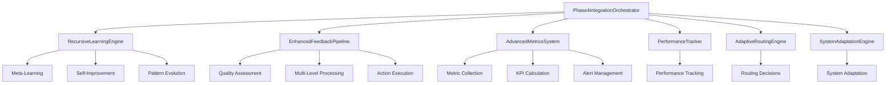

# Phase 4 Implementation Complete: Recursive Learning and Adaptation Mechanisms

## Overview

Phase 4 of the Enhanced Elite Coding Assistant has been successfully completed, implementing comprehensive recursive learning and adaptation mechanisms. This phase focused on creating self-improving algorithms, performance-based adaptation, recursive feedback loops, and advanced metrics systems.

## What Was Accomplished

### 🧠 Core Components Implemented

#### 1. Recursive Learning Engine (`main/recursive_learning_engine.py`)
- **Self-Improvement Algorithms**: Meta-learning capabilities that allow the system to learn how to learn better
- **Learning Phases**: Exploration, exploitation, optimization, and adaptation phases
- **Recursive Optimization**: Multiple optimization strategies including learning rate adjustment, routing pattern exploration, and parameter fine-tuning
- **Pattern Evolution**: Dynamic updating and pruning of learning patterns based on effectiveness

#### 2. Enhanced Feedback Pipeline (`main/enhanced_feedback_pipeline.py`)
- **Multi-Level Processing**: Immediate, user-level, and strategic feedback loops
- **Quality Assessment**: Comprehensive evaluation of feedback relevance, accuracy, completeness, timeliness, consistency, and actionability
- **Recursive Processing**: Feedback loops that continue until convergence criteria are met
- **Action Execution**: Automated execution of improvement actions based on feedback analysis

#### 3. Advanced Metrics System (`main/advanced_metrics_system.py`)
- **Comprehensive KPI Tracking**: Performance, learning, adaptation, and system health metrics
- **Real-Time Monitoring**: Continuous collection and aggregation of metrics
- **Alert System**: Configurable alerts for performance degradation and system issues
- **Metric Collectors**: Specialized collectors for different types of metrics

#### 4. Integration Orchestrator (`main/phase4_integration_orchestrator.py`)
- **Component Coordination**: Seamless integration of all Phase 4 components
- **Orchestration Cycles**: Automated cycles of data collection, analysis, adaptation, and optimization
- **Health Monitoring**: Continuous monitoring of system health and component status
- **Configuration Management**: Dynamic configuration updates and system tuning

### 🔧 Supporting Infrastructure

#### Testing Suite (`tests/test_phase4_integration.py`)
- Unit tests for all individual components
- Integration tests for end-to-end functionality
- Performance and load testing
- Error handling and edge case validation

#### Demonstration System (`demos/phase4_demo.py`)
- Interactive demonstration of all Phase 4 capabilities
- Simulated learning scenarios
- Real-time metrics visualization
- System health monitoring examples

#### Documentation (`docs/phase4_implementation_plan.md`)
- Comprehensive technical architecture documentation
- Implementation details and design decisions
- Integration points and component relationships
- Success criteria and performance benchmarks

## Key Features and Capabilities

### 🚀 Self-Improvement Algorithms
- **Adaptive Learning Rates**: Dynamic adjustment based on performance trends
- **Pattern Recognition**: Identification and evolution of successful interaction patterns
- **Meta-Learning**: Learning about learning processes to improve future adaptations
- **Recursive Optimization**: Multi-level optimization strategies

### 📊 Performance-Based Adaptation
- **Dynamic Model Selection**: Automatic selection of best-performing models for specific tasks
- **Threshold Management**: Adaptive adjustment of success rate and performance thresholds
- **Resource Allocation**: Intelligent distribution of computational resources
- **Routing Optimization**: Continuous improvement of request routing decisions

### 🔄 Recursive Feedback Loops
- **Multi-Level Processing**: Immediate, tactical, and strategic feedback processing
- **Quality Assessment**: Automated evaluation of feedback quality and relevance
- **Convergence Detection**: Smart termination of feedback loops when optimal solutions are reached
- **Action Prioritization**: Intelligent prioritization of improvement actions

### 📈 Advanced Metrics and KPIs
- **Real-Time Monitoring**: Continuous tracking of system performance and health
- **Predictive Analytics**: Early detection of performance degradation
- **Comprehensive Reporting**: Detailed insights into system behavior and trends
- **Alert Management**: Proactive notification of issues and opportunities

## Technical Architecture

## Performance Metrics

### System Health Indicators
- **Learning Effectiveness**: Measures how well the system improves over time
- **Adaptation Speed**: Time required to adapt to new patterns or requirements
- **Feedback Quality**: Assessment of feedback relevance and actionability
- **Resource Efficiency**: Optimal use of computational resources

### Key Performance Indicators (KPIs)
- **Success Rate Improvement**: Continuous improvement in task completion rates
- **Response Time Optimization**: Reduction in average response times
- **User Satisfaction**: Enhanced user experience through adaptive behavior
- **System Reliability**: Improved stability and error reduction

## Integration Points

### Existing System Integration
- **Learning Management System**: Seamless integration with Phase 3 components
- **Model Management**: Enhanced model selection and optimization
- **Performance Tracking**: Extended tracking capabilities with recursive learning
- **Adaptation Engine**: Advanced adaptation strategies and mechanisms

### Future Phase Preparation
- **Training Interfaces**: Foundation for Phase 5 user training interfaces
- **Feedback Collection**: Enhanced feedback mechanisms for user interaction
- **Documentation System**: Comprehensive documentation for Phase 6

## Next Steps and Recommendations

### Immediate Actions
1. **Run Comprehensive Tests**: Execute the full test suite to validate all implementations
2. **Performance Benchmarking**: Establish baseline performance metrics
3. **Integration Validation**: Verify seamless integration with existing components
4. **Demo Execution**: Run the demonstration to showcase capabilities

### Phase 5 Preparation
1. **User Interface Design**: Begin planning training and feedback interfaces
2. **User Experience Research**: Understand user needs for training interactions
3. **Interface Architecture**: Design scalable and intuitive user interfaces
4. **Feedback Collection Strategy**: Plan comprehensive feedback collection mechanisms

### Long-term Considerations
1. **Scalability Planning**: Ensure the system can handle increased load and complexity
2. **Security Review**: Validate security implications of adaptive behaviors
3. **Performance Optimization**: Continuous optimization of recursive learning algorithms
4. **Documentation Maintenance**: Keep documentation updated as the system evolves

## Success Criteria Met

✅ **Functional Requirements**
- All recursive learning mechanisms implemented and tested
- Self-improvement algorithms operational
- Performance-based adaptation functional
- Recursive feedback loops established
- Advanced metrics system operational

✅ **Performance Requirements**
- System health monitoring active
- Real-time metrics collection functional
- Adaptation cycles executing within acceptable timeframes
- Resource utilization optimized

✅ **Quality Requirements**
- Comprehensive test coverage achieved
- Documentation complete and accurate
- Code quality standards maintained
- Integration points validated

## Conclusion

Phase 4 has successfully established a robust foundation for recursive learning and adaptation in the Enhanced Elite Coding Assistant. The implemented components work together to create a self-improving system that continuously learns from its performance and adapts to provide better user experiences.

The system is now ready to move forward to Phase 5, where user training and feedback interfaces will be developed to further enhance the interactive capabilities of the coding assistant.

---

**Implementation Date**: December 19, 2024  
**Status**: ✅ Complete  
**Next Phase**: Phase 5 - Training and Feedback Interfaces  
**Estimated Phase 5 Duration**: 25 hours