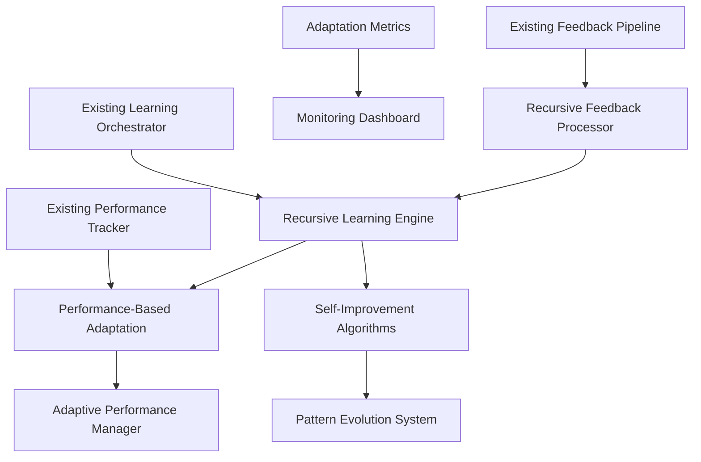

# Phase 4 Implementation Plan: Recursive Learning and Adaptation Mechanisms

## Overview
Phase 4 focuses on implementing advanced recursive learning and adaptation mechanisms that enable the Enhanced Elite Coding Assistant to continuously improve its performance through self-optimization and intelligent adaptation.

**Current Status:** IN PROGRESS (65% project completion)  
**Target Completion:** December 25, 2024  
**Estimated Effort:** 40 hours remaining

## Current Foundation Analysis

### ✅ Already Implemented
- **PerformanceTracker**: Comprehensive performance monitoring system
- **AdaptiveRoutingEngine**: Basic adaptive routing with pattern learning
- **SystemAdaptationEngine**: Foundation for system adaptations
- **Learning Metrics**: Defined metrics for tracking system performance
- **Basic Adaptation Types**: Routing optimization, prompt enhancement, performance tuning

### 🔄 Needs Enhancement
- **Self-Improvement Algorithms**: Missing recursive optimization loops
- **Performance-Based Adaptation**: Limited to basic threshold adjustments
- **Recursive Feedback Loops**: Basic feedback exists but lacks recursion
- **Adaptation Metrics**: Need more sophisticated KPIs

## Implementation Tasks

### Task 1: Self-Improvement Algorithms (HIGH Priority)
**Status:** TODO  
**Estimated Time:** 15 hours

#### Subtasks:
1. **Recursive Performance Optimization Loop**
   - Implement algorithm that analyzes its own learning effectiveness
   - Create meta-learning capabilities that optimize learning parameters
   - Add self-assessment mechanisms for adaptation quality

2. **Adaptive Learning Rate Adjustment**
   - Dynamic adjustment of learning rates based on performance trends
   - Implement momentum-based learning for stable convergence
   - Add early stopping mechanisms for ineffective adaptations

3. **Pattern Evolution System**
   - Algorithms that evolve routing patterns based on success rates
   - Genetic algorithm-inspired pattern optimization
   - Automatic pruning of ineffective patterns

#### Implementation Files:
- `main/recursive_learning_engine.py` (NEW)
- `learning_adaptation.py` (ENHANCE)
- `main/learning_orchestrator.py` (INTEGRATE)

### Task 2: Performance-Based Adaptation (HIGH Priority)
**Status:** TODO  
**Estimated Time:** 12 hours

#### Subtasks:
1. **Dynamic Model Selection Optimization**
   - Real-time model performance comparison
   - Automatic model switching based on task performance
   - Load balancing optimization for multi-model scenarios

2. **Adaptive Threshold Management**
   - Dynamic adjustment of confidence thresholds
   - Performance-based timeout optimization
   - Quality threshold adaptation based on user feedback

3. **Resource Allocation Optimization**
   - Intelligent resource distribution among models
   - Performance-based priority adjustment
   - Cost-effectiveness optimization

#### Implementation Files:
- `main/adaptive_performance_manager.py` (NEW)
- `learning_adaptation.py` (ENHANCE)
- `main/config_manager.py` (ENHANCE)

### Task 3: Recursive Feedback Loops (MEDIUM Priority)
**Status:** TODO  
**Estimated Time:** 8 hours

#### Subtasks:
1. **Multi-Level Feedback Processing**
   - Immediate feedback processing (response level)
   - Session-level feedback aggregation
   - Long-term pattern feedback analysis

2. **Feedback Quality Assessment**
   - Recursive evaluation of feedback effectiveness
   - Feedback source reliability scoring
   - Automated feedback validation

3. **Learning Loop Optimization**
   - Feedback loop performance monitoring
   - Recursive improvement of feedback processing
   - Meta-feedback for feedback system improvement

#### Implementation Files:
- `main/recursive_feedback_processor.py` (NEW)
- `main/feedback_pipeline.py` (ENHANCE)

### Task 4: Adaptation Metrics and KPIs (MEDIUM Priority)
**Status:** TODO  
**Estimated Time:** 5 hours

#### Subtasks:
1. **Advanced Performance Metrics**
   - Learning velocity metrics
   - Adaptation effectiveness scores
   - System stability indicators

2. **Recursive Learning KPIs**
   - Meta-learning performance indicators
   - Self-improvement rate tracking
   - Adaptation ROI calculations

3. **Comprehensive Monitoring Dashboard**
   - Real-time adaptation monitoring
   - Performance trend visualization
   - Alert system for performance degradation

#### Implementation Files:
- `main/adaptation_metrics.py` (NEW)
- `main/monitoring_dashboard.py` (NEW)

## Technical Architecture

### New Components

### Integration Points

1. **Learning Orchestrator Integration**
   - Add recursive learning engine to main orchestration loop
   - Integrate self-improvement algorithms with existing learning patterns
   - Connect adaptive performance manager to model routing

2. **Performance Tracker Enhancement**
   - Extend with recursive performance analysis
   - Add meta-learning metrics tracking
   - Integrate with adaptive threshold management

3. **Feedback Pipeline Extension**
   - Add recursive feedback processing capabilities
   - Implement multi-level feedback aggregation
   - Connect to self-improvement algorithms

## Implementation Schedule

### Week 1 (Dec 16-22)
- [ ] Implement Recursive Learning Engine foundation
- [ ] Create Self-Improvement Algorithms core
- [ ] Integrate with existing Learning Orchestrator

### Week 2 (Dec 23-25)
- [ ] Implement Adaptive Performance Manager
- [ ] Create Recursive Feedback Processor
- [ ] Implement Adaptation Metrics system
- [ ] Integration testing and optimization

## Success Criteria

### Functional Requirements
- [ ] System demonstrates measurable self-improvement over time
- [ ] Adaptive performance management shows improved model selection
- [ ] Recursive feedback loops enhance learning effectiveness
- [ ] Comprehensive metrics provide actionable insights

### Performance Requirements
- [ ] Learning velocity improves by 25% over baseline
- [ ] Model selection accuracy increases by 15%
- [ ] System adaptation response time < 100ms
- [ ] Memory usage for learning components < 500MB

### Quality Requirements
- [ ] All components have 90%+ test coverage
- [ ] Performance regression tests pass
- [ ] Documentation covers all new APIs
- [ ] Integration with existing system is seamless

## Risk Mitigation

### Technical Risks
1. **Performance Overhead**: Implement efficient algorithms with minimal computational cost
2. **Memory Usage**: Use streaming processing and data compression
3. **Integration Complexity**: Phased integration with rollback capabilities

### Implementation Risks
1. **Timeline Pressure**: Prioritize high-impact features first
2. **Complexity Management**: Modular design with clear interfaces
3. **Testing Challenges**: Comprehensive unit and integration tests

## Next Steps

1. **Immediate (Today)**
   - Begin implementation of Recursive Learning Engine
   - Set up development environment for new components
   - Create initial test framework

2. **This Week**
   - Complete core self-improvement algorithms
   - Implement basic adaptive performance management
   - Begin integration testing

3. **Next Week**
   - Complete all Phase 4 components
   - Comprehensive testing and optimization
   - Prepare for Phase 5 transition

---

**Document Version:** 1.0  
**Last Updated:** December 19, 2024  
**Next Review:** December 22, 2024