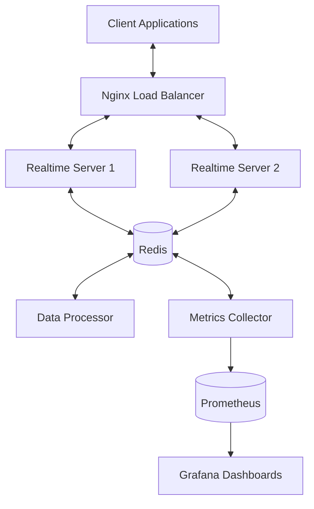

# Elite Coding Assistant Real-Time Features

## Overview

The Elite Coding Assistant Real-Time Features module provides a comprehensive set of real-time communication capabilities that enhance the collaborative and interactive aspects of the system. This document outlines the architecture, components, and usage of these features.

## Table of Contents

1. [Architecture](#architecture)
2. [Core Components](#core-components)
   - [WebSocket Infrastructure](#websocket-infrastructure)
   - [Live Data Streaming](#live-data-streaming)
   - [Interactive Features](#interactive-features)
3. [Setup and Deployment](#setup-and-deployment)
4. [API Reference](#api-reference)
5. [Client Integration](#client-integration)
6. [Performance Considerations](#performance-considerations)
7. [Security](#security)
8. [Monitoring](#monitoring)
9. [Troubleshooting](#troubleshooting)

## Architecture

The real-time features are built on a scalable, event-driven architecture that leverages WebSockets for bidirectional communication and Redis for pub/sub messaging and state management. The system is designed to be horizontally scalable, fault-tolerant, and performant under high load.



## Core Components

### WebSocket Infrastructure

The WebSocket infrastructure provides the foundation for real-time bidirectional communication between clients and the server.

#### Key Features

- **Connection Management**: Handles client connections, authentication, and session tracking
- **Event Routing**: Routes messages to appropriate handlers based on event type
- **Broadcasting**: Sends messages to specific users, groups, or all connected clients
- **Heartbeat**: Monitors connection health and detects stale connections
- **Scalability**: Distributes connections across multiple server instances using Redis

#### Message Format

All WebSocket messages follow a standard JSON format:

```json
{
  "event_type": "string",  // Type of event (e.g., "chat", "collaboration", "system")
  "payload": {},          // Event-specific data
  "timestamp": "string",  // ISO format timestamp
  "session_id": "string", // Optional session identifier
  "user_id": "string"     // User identifier
}
```

#### Event Types

- `chat`: Real-time chat messages
- `collaboration`: Code editing and collaboration events
- `system`: System notifications and status updates
- `ai`: AI model responses and streaming
- `debugging`: Live debugging session events

### Live Data Streaming

The Live Data Streaming component processes and broadcasts real-time data streams for metrics, feedback, and model performance monitoring.

#### Key Features

- **Metrics Dashboard**: Real-time performance metrics and usage statistics
- **Feedback Processing**: Immediate incorporation of user feedback
- **Model Performance**: Live tracking of AI model accuracy and response times

#### Data Stream Types

- **Metrics Stream**: System and application performance metrics
- **Feedback Stream**: User feedback and ratings
- **Model Performance Stream**: AI model evaluation metrics

#### Implementation

The system uses Redis Streams for reliable, ordered message delivery with consumer groups for load balancing across multiple consumers.

### Interactive Features

The Interactive Features component provides collaborative and interactive capabilities for real-time user engagement.

#### Key Features

- **Live Code Collaboration**: Real-time collaborative code editing
- **Instant Notifications**: Push notifications for system events
- **Live Debugging Sessions**: Real-time debugging with immediate feedback
- **Cursor Tracking**: Shows user cursor positions in collaborative sessions
- **Chat Integration**: Integrated chat for communication during collaboration

#### Operational Transformation

For collaborative editing, the system implements Operational Transformation (OT) to ensure consistency across multiple concurrent edits.

## Setup and Deployment

### Prerequisites

- Docker and Docker Compose
- Python 3.11+
- Redis 6.2+
- Nginx (for production deployments)

### Quick Start

1. Clone the repository
2. Install dependencies:
   ```bash
   pip install -r requirements_realtime.txt
   ```
3. Run the deployment script:
   ```bash
   python deploy_realtime.py deploy
   ```

### Configuration

The system can be configured through environment variables or a configuration file. Key configuration options include:

- `REDIS_URL`: Redis connection URL
- `WS_HOST`: WebSocket server host
- `WS_PORT`: WebSocket server port
- `AUTH_SECRET`: Authentication secret key
- `LOG_LEVEL`: Logging level

### Docker Deployment

For production deployments, use the provided Docker Compose configuration:

```bash
docker-compose -f docker/docker-compose.realtime.yml up -d
```

## API Reference

### WebSocket API

#### Connection

```
ws://hostname:port/ws?token=<auth_token>
```

#### Events

| Event Type | Direction | Description |
|------------|-----------|-------------|
| `connect` | Server → Client | Sent when connection is established |
| `disconnect` | Server → Client | Sent before disconnection |
| `error` | Server → Client | Error notification |
| `chat.message` | Bidirectional | Chat message |
| `collaboration.edit` | Bidirectional | Code edit operation |
| `collaboration.cursor` | Bidirectional | Cursor position update |
| `system.notification` | Server → Client | System notification |
| `ai.response` | Server → Client | AI response chunk |
| `debugging.breakpoint` | Bidirectional | Debugging breakpoint event |

### REST API

#### Health Check

```
GET /health
```

Returns system health status.

#### WebSocket Stats

```
GET /ws/stats
```

Returns WebSocket connection statistics.

#### Metrics

```
GET /api/metrics
```

Returns system metrics.

#### Feedback

```
POST /api/feedback
```

Submits user feedback.

## Client Integration

### JavaScript Client

```javascript
// Example WebSocket client
const ws = new WebSocket(`ws://localhost:8001/ws?token=${authToken}`);

ws.onopen = () => {
  console.log('Connected to WebSocket server');
};

ws.onmessage = (event) => {
  const message = JSON.parse(event.data);
  console.log('Received message:', message);
  
  // Handle different event types
  switch (message.event_type) {
    case 'chat.message':
      handleChatMessage(message.payload);
      break;
    case 'collaboration.edit':
      handleCollaborationEdit(message.payload);
      break;
    // Handle other event types
  }
};

// Send a message
function sendMessage(eventType, payload) {
  ws.send(JSON.stringify({
    event_type: eventType,
    payload: payload,
    timestamp: new Date().toISOString()
  }));
}
```

### Python Client

```python
import asyncio
import json
import websockets

async def connect_websocket(uri, token):
    async with websockets.connect(f"{uri}?token={token}") as websocket:
        # Handle incoming messages
        async def receive_messages():
            while True:
                message = await websocket.recv()
                data = json.loads(message)
                print(f"Received: {data}")
                
                # Handle different event types
                if data["event_type"] == "chat.message":
                    handle_chat_message(data["payload"])
                # Handle other event types
        
        # Send a message
        async def send_message(event_type, payload):
            message = {
                "event_type": event_type,
                "payload": payload,
                "timestamp": datetime.datetime.now().isoformat()
            }
            await websocket.send(json.dumps(message))
        
        # Example: Send a chat message
        await send_message("chat.message", {"content": "Hello, world!"})
        
        # Start receiving messages
        await receive_messages()

# Run the client
asyncio.run(connect_websocket("ws://localhost:8001/ws", "your_auth_token"))
```

## Performance Considerations

### Scaling

The real-time features are designed to scale horizontally. Key scaling considerations include:

- **Connection Distribution**: WebSocket connections are distributed across multiple server instances
- **Redis Pub/Sub**: Used for cross-server communication
- **Load Balancing**: Nginx provides load balancing for WebSocket connections
- **Connection Pooling**: Redis connection pooling reduces connection overhead

### Optimizations

- **Message Batching**: Batches small messages to reduce overhead
- **Selective Broadcasting**: Sends messages only to relevant clients
- **Heartbeat Interval**: Configurable to balance responsiveness and overhead
- **Connection Limits**: Per-server connection limits prevent overload

## Security

### Authentication

All WebSocket connections require authentication via a JWT token passed as a query parameter.

### Authorization

Message handlers validate that users have appropriate permissions for requested actions.

### Rate Limiting

The system implements rate limiting to prevent abuse:

- Connection rate limiting
- Message rate limiting
- API endpoint rate limiting

### Data Validation

All incoming messages are validated against schemas to prevent injection attacks.

## Monitoring

### Metrics

The system exposes the following metrics:

- Active WebSocket connections
- Message throughput
- Error rates
- Response times
- Redis operation latency

### Dashboards

Grafana dashboards provide real-time visibility into system performance:

- Connection dashboard
- Message throughput dashboard
- Error dashboard
- Performance dashboard

### Alerts

Prometheus alerts notify operators of potential issues:

- High error rates
- Connection spikes or drops
- Slow response times
- Redis latency

## Troubleshooting

### Common Issues

#### Connection Failures

- Check authentication token validity
- Verify WebSocket server is running
- Check for network issues
- Verify client WebSocket implementation

#### Message Delivery Issues

- Check Redis connectivity
- Verify message format
- Check for rate limiting
- Examine server logs for errors

#### Performance Problems

- Monitor Redis memory usage
- Check server resource utilization
- Verify connection count per server
- Examine message throughput metrics

### Logging

The system uses structured logging with the following levels:

- `DEBUG`: Detailed debugging information
- `INFO`: General operational information
- `WARNING`: Warning events
- `ERROR`: Error events that allow recovery
- `CRITICAL`: Critical events requiring immediate attention

### Health Checks

The following health check endpoints are available:

- `/health`: Overall system health
- `/health/redis`: Redis connectivity
- `/health/websocket`: WebSocket subsystem health

## Conclusion

The Elite Coding Assistant Real-Time Features provide a robust foundation for interactive, collaborative experiences. By leveraging WebSockets, Redis, and a scalable architecture, the system delivers high-performance real-time communication capabilities that enhance the overall user experience.