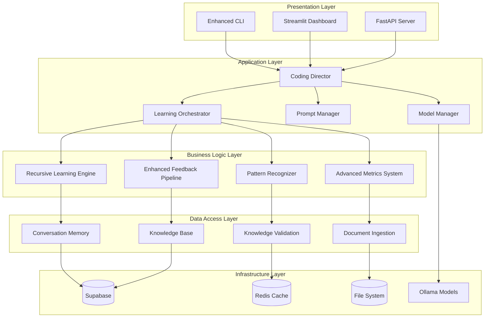

# Elite Coding Assistant - Technical Documentation

**Version**: 2.0  
**Date**: December 2024  
**Target Audience**: Developers, System Administrators, DevOps Engineers  

## 📋 Table of Contents

1. [Architecture Overview](#architecture-overview)
2. [System Components](#system-components)
3. [API Documentation](#api-documentation)
4. [Database Schema](#database-schema)
5. [Deployment Guide](#deployment-guide)
6. [Configuration Reference](#configuration-reference)
7. [Development Setup](#development-setup)
8. [Testing Framework](#testing-framework)
9. [Monitoring and Logging](#monitoring-and-logging)
10. [Security Implementation](#security-implementation)
11. [Performance Optimization](#performance-optimization)
12. [Troubleshooting Guide](#troubleshooting-guide)

## 🏗️ Architecture Overview

### System Architecture

The Elite Coding Assistant follows a modular, microservices-inspired architecture with clear separation of concerns:



### Design Principles

1. **Modularity**: Each component has a single responsibility
2. **Scalability**: Horizontal scaling support through stateless design
3. **Extensibility**: Plugin architecture for custom extensions
4. **Reliability**: Fault tolerance with graceful degradation
5. **Performance**: Optimized for sub-second response times
6. **Security**: Security-first design with comprehensive protection

### Technology Stack

#### Core Technologies
```yaml
Languages:
  - Python: 3.11+
  - TypeScript: 4.9+ (for frontend components)
  - SQL: PostgreSQL dialect

Frameworks:
  - FastAPI: 0.104+ (API server)
  - Streamlit: 1.28+ (web dashboard)
  - Pydantic: 2.5+ (data validation)
  - SQLAlchemy: 2.0+ (ORM)

AI/ML:
  - Ollama: Local LLM integration
  - Transformers: 4.35+ (Hugging Face)
  - Sentence-Transformers: 2.2+
  - scikit-learn: 1.3+

Infrastructure:
  - Supabase: Database and real-time features
  - Redis: 7.0+ (caching and sessions)
  - Docker: 24.0+ (containerization)
  - Nginx: 1.24+ (reverse proxy)
```

## 🔧 System Components

### Core Components

#### 1. Configuration Manager (`main/config_manager.py`)

**Purpose**: Loads, validates, and provides access to system and model configurations.

**Key Classes & Functionality**:
- `ConfigManager`: Orchestrates loading of `config/system.json` and `config/models.json`.
- `SystemConfig` (Pydantic Model): Structures system-level settings like logging configuration, Ollama host/port, and computes the `ollama_base_url`.
- `ModelsConfig`, `IndividualModelConfig`, `ModelPerformanceConfig` (Pydantic Models): Define the schema for LLM configurations, including roles, specific Ollama model IDs (e.g., `openhermes:7b`), system prompts, and detailed performance parameters (temperature, max_tokens, top_p, top_k, repeat_penalty, context_length, timeout).
- Provides access methods like `get_config()` (returns `EnhancedConfig`), `get_system_config()`, `get_models_config()`, and `get_model_config(role_name: str)`.
- Ensures all loaded configurations are validated against these Pydantic schemas.

**Implementation Highlights**:
```python
class ConfigManager:
    def load_config(self) -> EnhancedConfig: # Returns Pydantic validated config
    # ...
```

#### 2. Model Manager (`main/model_manager.py`)

**Purpose**: Central service for managing and interacting with all configured LLMs, primarily through `LocalLLMClient`.

**Key Classes & Functionality**:
- `ModelManager`:
    - Initialized with an `EnhancedConfig` object (from `ConfigManager`).
    - Instantiates `LocalLLMClient`, passing the `SystemConfig` (which includes the `ollama_base_url`).
    - `initialize_clients()`: Critical async method that must be called after instantiation. It primes the `LocalLLMClient` with all model definitions from `EnhancedConfig.models` (using `LocalLLMClient.prime_model_configurations()`) and then establishes the connection to Ollama via `LocalLLMClient.connect()`.
    - `get_completion_by_role(role: str, prompt: str, **kwargs)`: Primary interface for agents. It retrieves the `IndividualModelConfig` for the given role, and calls `LocalLLMClient.generate_response()`, passing the correct Ollama `model_id`, the user `prompt`, the role's configured `system_prompt` (unless overridden), and all specified `performance` parameters (temperature, max_tokens, top_p, top_k, repeat_penalty). Supports streaming.
    - `get_embeddings(texts: List[str], model_name: Optional[str] = None)`: Generates embeddings by calling `LocalLLMClient.generate_embeddings_ollama()`. It can use a specified `model_name` or defaults to a system-defined embedding model (currently "nomic-embed-text", future improvement to make this configurable).
    - `health_check_models()`: Delegates to `LocalLLMClient.health_check()` for Ollama and model status.

**Implementation Highlights**:
```python
class ModelManager:
    async def initialize_clients(self): # Primes and connects LocalLLMClient
    async def get_completion_by_role(self, role: str, prompt: str, **kwargs) -> ...:
    async def get_embeddings(self, texts: List[str], model_name: Optional[str]) -> ...:
```

#### 3. Coding Director (`main/coding_director.py`)

**Purpose**: The main orchestrator for handling coding-related requests. It's a standard Python class using Pydantic models for I/O, not a direct `pydantic-ai.Agent` subclass.

**Key Classes & Functionality**:
- `CodingDirector`:
    - Initializes with `ConfigManager` and `ModelManager` instances as dependencies.
    - `initialize()`: Async method to ensure its `ModelManager` (and thus `LocalLLMClient`) is initialized and connected. Returns `True` on success.
    - Defines Pydantic models for its request and response structures:
        - `CodingTaskRequestContext`: Captures user input, including prompt, language, conversation history, retrieved knowledge, recognized patterns, and other project/file context. Validated on input.
        - `CodingDirectorFinalResult`: Structured output detailing the task classification, the final LLM response content, the specific model ID and role that generated it, any errors, and processing time.
    - `process_request(context: CodingTaskRequestContext)`:
        - Performs initial validation of the `context`.
        - Calls `initialize()` if not already done.
        - Invokes `classify_task()` which uses the "router" LLM (via `ModelManager`) to classify the `user_prompt` (e.g., into "math" or "general").
        - Constructs a detailed prompt for specialist LLMs by combining `user_prompt` with other relevant information from `CodingTaskRequestContext` (language, history, knowledge, file paths, etc.).
        - Routes to a primary specialist ("math_specialist" or "lead_developer") via `ModelManager.get_completion_by_role()`.
        - Implements a fallback chain (to "senior_developer", then "principal_architect") if earlier models fail or return empty/unsatisfactory content.
    - Manages errors gracefully throughout the process, populating `CodingDirectorFinalResult.error_message` if issues occur.

**Implementation Highlights**:
```python
class CodingDirector:
    async def initialize(self) -> bool: # Ensures ModelManager is ready
    async def classify_task(self, user_prompt: str) -> Optional[str]: # Uses 'router' model
    async def process_request(self, context: CodingTaskRequestContext) -> CodingDirectorFinalResult: # Main orchestration
```

#### 3.1. Local LLM Client (`utils/local_llm_client.py`)
*(Note: This is a utility but crucial for ModelManager)*

**Purpose**: Provides a direct, low-level interface to the Ollama API for all local LLM interactions.

**Key Functionality**:
- Uses `ollama.AsyncClient` for all HTTP communications with the Ollama server, configured with the `ollama_base_url` from `SystemConfig`.
- `prime_model_configurations(configured_models: List[IndividualModelConfig])`: Method called by `ModelManager` during initialization. It takes a list of `IndividualModelConfig` objects (derived from `config/models.json`) and populates its internal `self.models` dictionary with `ModelConfig` instances. This makes the client aware of all usable models and their default parameters (like `context_window` which maps to `num_ctx`).
- `generate_response(model_name: str, prompt: str, system_prompt: Optional[str], ...)`: The core method for generating text via Ollama's chat completions. It accepts the Ollama `model_id` (e.g., "openhermes:7b"), user prompt, system prompt, and a comprehensive set of Ollama-specific performance parameters (`temperature`, `num_predict` (max_tokens), `top_p`, `top_k`, `repeat_penalty`, `num_ctx`). It supports both streaming and non-streaming responses and returns a structured `ModelResponse` or an async generator.
- `generate_embeddings_ollama(model_name: str, texts: List[str])`: A new method that calls the Ollama `/api/embeddings` endpoint for each text provided, using the specified Ollama `model_name` (which should be an embedding model like "nomic-embed-text").
- Manages and updates detailed performance metrics (`ModelPerformanceMetrics`) for each model it interacts with, including request counts, success/failure rates, average response times, and tokens per second.
- `connect()`: Establishes the initial connection and verifies that the primed models are actually available in the Ollama instance by calling `ollama.AsyncClient.list()`. Marks unavailable models as disabled.
- `health_check()`: Provides ongoing status of the Ollama connection and model availability.

#### 3. Recursive Learning Engine (`main/recursive_learning_engine.py`)

**Purpose**: Implements self-improving learning algorithms

**Key Classes**:
```python
class RecursiveLearningEngine:
    """Advanced learning system with recursive improvement"""
    
    def __init__(self, config: LearningConfig):
        self.pattern_recognizer = PatternRecognizerAgent()
        self.performance_analyzer = PerformanceAnalyzer()
        self.knowledge_synthesizer = KnowledgeSynthesizer()
    
    async def learn_from_feedback(self, feedback: Feedback) -> LearningResult:
        """Learn from user feedback and improve suggestions"""
        
    async def analyze_patterns(self, interactions: List[Interaction]) -> PatternAnalysis:
        """Analyze interaction patterns for learning opportunities"""
        
    async def synthesize_knowledge(self, sources: List[KnowledgeSource]) -> Knowledge:
        """Synthesize knowledge from multiple sources"""
```

**Learning Algorithms**:
- Pattern recognition and analysis
- Performance correlation analysis
- Knowledge graph construction
- Adaptive suggestion ranking

### Data Layer Components

#### 4. Conversation Memory (`main/conversation_memory.py`)

**Purpose**: Manages conversation history and context

**Key Features**:
```python
class ConversationMemory:
    """Manages conversation history with semantic search"""
    
    async def store_interaction(self, interaction: Interaction) -> str:
        """Store interaction with metadata and embeddings"""
        
    async def retrieve_context(self, query: str, limit: int = 10) -> List[Interaction]:
        """Retrieve relevant context using semantic similarity"""
        
    async def get_conversation_summary(self, conversation_id: str) -> ConversationSummary:
        """Generate conversation summary for context"""
```

#### 5. Knowledge Base (`main/supabase_learning_client.py`)

**Purpose**: Persistent knowledge storage and retrieval

**Schema**:
```sql
-- Knowledge items table
CREATE TABLE knowledge_items (
    id UUID PRIMARY KEY DEFAULT gen_random_uuid(),
    title TEXT NOT NULL,
    content TEXT NOT NULL,
    category TEXT,
    tags TEXT[],
    embedding VECTOR(1536),
    confidence_score FLOAT DEFAULT 0.0,
    created_at TIMESTAMP WITH TIME ZONE DEFAULT NOW(),
    updated_at TIMESTAMP WITH TIME ZONE DEFAULT NOW()
);

-- Learning interactions table
CREATE TABLE learning_interactions (
    id UUID PRIMARY KEY DEFAULT gen_random_uuid(),
    user_id TEXT,
    interaction_type TEXT NOT NULL,
    input_data JSONB,
    output_data JSONB,
    feedback JSONB,
    performance_metrics JSONB,
    created_at TIMESTAMP WITH TIME ZONE DEFAULT NOW()
);
```

### Processing Components

#### 6. Document Ingestion System (`main/document_ingestion_system.py`)

**Purpose**: Processes and extracts knowledge from documents

**Supported Formats**:
- PDF documents
- Microsoft Word (.docx)
- Markdown files
- Plain text files
- HTML documents

**Processing Pipeline**:
```python
class DocumentIngestionSystem:
    """Advanced document processing and knowledge extraction"""
    
    async def process_document(self, file_path: str) -> ProcessingResult:
        """Process document through complete pipeline"""
        
    async def extract_content(self, file_path: str) -> DocumentContent:
        """Extract text content and metadata"""
        
    async def chunk_content(self, content: str) -> List[ContentChunk]:
        """Split content into semantic chunks"""
        
    async def generate_embeddings(self, chunks: List[ContentChunk]) -> List[EmbeddedChunk]:
        """Generate embeddings for semantic search"""
```

## 🌐 API Documentation

### REST API Endpoints

The FastAPI server provides comprehensive REST endpoints:

#### Authentication
```http
POST /api/auth/login
Content-Type: application/json

{
  "username": "user@example.com",
  "password": "secure_password"
}

Response:
{
  "access_token": "jwt_token_here",
  "token_type": "bearer",
  "expires_in": 3600
}
```

#### Code Assistance
```http
POST /api/code/suggest
Authorization: Bearer {token}
Content-Type: application/json

{
  "code": "def calculate_",
  "language": "python",
  "context": {
    "file_path": "/path/to/file.py",
    "project_path": "/path/to/project",
    "cursor_position": 42
  },
  "preferences": {
    "style": "pep8",
    "max_suggestions": 5
  }
}

Response:
{
  "suggestions": [
    {
      "id": "suggestion_123",
      "code": "def calculate_total(items: List[Item]) -> float:",
      "description": "Calculate total value from list of items",
      "confidence": 0.95,
      "type": "completion"
    }
  ],
  "metadata": {
    "processing_time": 0.15,
    "model_used": "codellama"
  }
}
```

#### Learning and Feedback
```http
POST /api/learning/feedback
Authorization: Bearer {token}
Content-Type: application/json

{
  "suggestion_id": "suggestion_123",
  "feedback_type": "rating",
  "rating": 5,
  "comments": "Very helpful suggestion",
  "context": {
    "applied": true,
    "modified": false
  }
}

Response:
{
  "status": "success",
  "learning_impact": {
    "pattern_updated": true,
    "confidence_adjusted": 0.02
  }
}
```

#### Knowledge Management
```http
GET /api/knowledge/search
Authorization: Bearer {token}

?query=error handling patterns&limit=10&category=best_practices

Response:
{
  "results": [
    {
      "id": "knowledge_456",
      "title": "Python Error Handling Best Practices",
      "content": "...",
      "relevance_score": 0.92,
      "category": "best_practices"
    }
  ],
  "total_count": 25,
  "search_time": 0.08
}
```

### WebSocket API

Real-time communication for interactive features:

```javascript
// Connect to WebSocket
const ws = new WebSocket('ws://localhost:8000/ws/coding-session');

// Send coding request
ws.send(JSON.stringify({
  type: 'code_request',
  data: {
    code: 'def process_data(',
    language: 'python',
    context: {...}
  }
}));

// Receive real-time suggestions
ws.onmessage = (event) => {
  const response = JSON.parse(event.data);
  if (response.type === 'suggestion') {
    // Handle suggestion
  }
};
```

## 🗄️ Database Schema

### Supabase Schema

#### Core Tables

```sql
-- Users and authentication
CREATE TABLE users (
    id UUID PRIMARY KEY DEFAULT gen_random_uuid(),
    email TEXT UNIQUE NOT NULL,
    username TEXT UNIQUE,
    preferences JSONB DEFAULT '{}',
    created_at TIMESTAMP WITH TIME ZONE DEFAULT NOW(),
    updated_at TIMESTAMP WITH TIME ZONE DEFAULT NOW()
);

-- Conversations and sessions
CREATE TABLE conversations (
    id UUID PRIMARY KEY DEFAULT gen_random_uuid(),
    user_id UUID REFERENCES users(id),
    title TEXT,
    context JSONB,
    created_at TIMESTAMP WITH TIME ZONE DEFAULT NOW(),
    updated_at TIMESTAMP WITH TIME ZONE DEFAULT NOW()
);

-- Individual messages/interactions
CREATE TABLE interactions (
    id UUID PRIMARY KEY DEFAULT gen_random_uuid(),
    conversation_id UUID REFERENCES conversations(id),
    user_id UUID REFERENCES users(id),
    type TEXT NOT NULL, -- 'user_input', 'assistant_response', 'system'
    content TEXT NOT NULL,
    metadata JSONB DEFAULT '{}',
    embedding VECTOR(1536),
    created_at TIMESTAMP WITH TIME ZONE DEFAULT NOW()
);

-- Knowledge base items
CREATE TABLE knowledge_items (
    id UUID PRIMARY KEY DEFAULT gen_random_uuid(),
    title TEXT NOT NULL,
    content TEXT NOT NULL,
    category TEXT,
    tags TEXT[],
    source_type TEXT, -- 'document', 'interaction', 'manual'
    source_reference TEXT,
    embedding VECTOR(1536),
    confidence_score FLOAT DEFAULT 0.0,
    validation_status TEXT DEFAULT 'pending',
    created_at TIMESTAMP WITH TIME ZONE DEFAULT NOW(),
    updated_at TIMESTAMP WITH TIME ZONE DEFAULT NOW()
);

-- Learning feedback
CREATE TABLE feedback (
    id UUID PRIMARY KEY DEFAULT gen_random_uuid(),
    user_id UUID REFERENCES users(id),
    interaction_id UUID REFERENCES interactions(id),
    feedback_type TEXT NOT NULL, -- 'rating', 'correction', 'comment'
    rating INTEGER CHECK (rating >= 1 AND rating <= 5),
    content TEXT,
    metadata JSONB DEFAULT '{}',
    processed BOOLEAN DEFAULT FALSE,
    created_at TIMESTAMP WITH TIME ZONE DEFAULT NOW()
);

-- Performance metrics
CREATE TABLE performance_metrics (
    id UUID PRIMARY KEY DEFAULT gen_random_uuid(),
    metric_type TEXT NOT NULL,
    metric_name TEXT NOT NULL,
    value FLOAT NOT NULL,
    metadata JSONB DEFAULT '{}',
    recorded_at TIMESTAMP WITH TIME ZONE DEFAULT NOW()
);

-- Document processing records
CREATE TABLE processed_documents (
    id UUID PRIMARY KEY DEFAULT gen_random_uuid(),
    file_path TEXT NOT NULL,
    file_hash TEXT NOT NULL,
    processing_status TEXT DEFAULT 'pending',
    extracted_chunks INTEGER DEFAULT 0,
    processing_metadata JSONB DEFAULT '{}',
    created_at TIMESTAMP WITH TIME ZONE DEFAULT NOW(),
    updated_at TIMESTAMP WITH TIME ZONE DEFAULT NOW()
);
```

#### Indexes for Performance

```sql
-- Embedding similarity search
CREATE INDEX idx_interactions_embedding ON interactions 
USING ivfflat (embedding vector_cosine_ops) WITH (lists = 100);

CREATE INDEX idx_knowledge_embedding ON knowledge_items 
USING ivfflat (embedding vector_cosine_ops) WITH (lists = 100);

-- Text search
CREATE INDEX idx_knowledge_content_fts ON knowledge_items 
USING gin(to_tsvector('english', content));

-- Performance queries
CREATE INDEX idx_interactions_user_created ON interactions(user_id, created_at);
CREATE INDEX idx_feedback_processed ON feedback(processed, created_at);
CREATE INDEX idx_metrics_type_recorded ON performance_metrics(metric_type, recorded_at);
```

### Redis Schema

#### Cache Structure

```python
# Session cache
session:{user_id} = {
    "current_conversation": "conversation_uuid",
    "preferences": {...},
    "last_activity": "timestamp"
}

# Model response cache
model_cache:{hash} = {
    "response": "cached_response",
    "model": "model_name",
    "timestamp": "cache_time",
    "ttl": 3600
}

# Performance metrics cache
metrics:{metric_type}:{timeframe} = {
    "values": [1.2, 1.5, 1.1, ...],
    "timestamps": ["2024-01-01T10:00:00Z", ...],
    "aggregated": {"avg": 1.27, "max": 1.5, "min": 1.1}
}
```

## 🚀 Deployment Guide

### Local Development

#### Prerequisites
```bash
# Install Python 3.11+
pyenv install 3.11.6
pyenv local 3.11.6

# Install Poetry
curl -sSL https://install.python-poetry.org | python3 -

# Install Redis
# macOS
brew install redis
# Ubuntu
sudo apt-get install redis-server

# Install Ollama
curl -fsSL https://ollama.ai/install.sh | sh
```

#### Setup Steps
```bash
# Clone repository
git clone https://github.com/your-org/elite-coding-assistant.git
cd elite-coding-assistant

# Install dependencies
poetry install

# Set up environment
cp .env.example .env
# Edit .env with your configuration

# Start services
redis-server &
ollama serve &

# Initialize database
poetry run python scripts/init_database.py

# Start development server
poetry run python main/main.py
```

### Docker Deployment

#### Docker Compose
```yaml
# docker-compose.yml
version: '3.8'

services:
  app:
    build: .
    ports:
      - "8000:8000"
    environment:
      - ENVIRONMENT=production
      - SUPABASE_URL=${SUPABASE_URL}
      - SUPABASE_KEY=${SUPABASE_KEY}
      - REDIS_URL=redis://redis:6379
    depends_on:
      - redis
      - ollama
    volumes:
      - ./data:/app/data
      - ./logs:/app/logs

  redis:
    image: redis:7-alpine
    ports:
      - "6379:6379"
    volumes:
      - redis_data:/data

  ollama:
    image: ollama/ollama:latest
    ports:
      - "11434:11434"
    volumes:
      - ollama_data:/root/.ollama
    environment:
      - OLLAMA_HOST=0.0.0.0

  nginx:
    image: nginx:alpine
    ports:
      - "80:80"
      - "443:443"
    volumes:
      - ./nginx.conf:/etc/nginx/nginx.conf
      - ./ssl:/etc/nginx/ssl
    depends_on:
      - app

volumes:
  redis_data:
  ollama_data:
```

#### Dockerfile
```dockerfile
FROM python:3.11-slim

# Set working directory
WORKDIR /app

# Install system dependencies
RUN apt-get update && apt-get install -y \
    build-essential \
    curl \
    && rm -rf /var/lib/apt/lists/*

# Install Poetry
RUN pip install poetry

# Copy dependency files
COPY pyproject.toml poetry.lock ./

# Install dependencies
RUN poetry config virtualenvs.create false \
    && poetry install --no-dev

# Copy application code
COPY . .

# Create non-root user
RUN useradd -m -u 1000 appuser && chown -R appuser:appuser /app
USER appuser

# Expose port
EXPOSE 8000

# Health check
HEALTHCHECK --interval=30s --timeout=10s --start-period=5s --retries=3 \
    CMD curl -f http://localhost:8000/health || exit 1

# Start application
CMD ["python", "main/main.py"]
```

### Production Deployment

#### Kubernetes Deployment
```yaml
# k8s/deployment.yaml
apiVersion: apps/v1
kind: Deployment
metadata:
  name: elite-coding-assistant
  labels:
    app: elite-coding-assistant
spec:
  replicas: 3
  selector:
    matchLabels:
      app: elite-coding-assistant
  template:
    metadata:
      labels:
        app: elite-coding-assistant
    spec:
      containers:
      - name: app
        image: elite-coding-assistant:latest
        ports:
        - containerPort: 8000
        env:
        - name: ENVIRONMENT
          value: "production"
        - name: SUPABASE_URL
          valueFrom:
            secretKeyRef:
              name: app-secrets
              key: supabase-url
        - name: SUPABASE_KEY
          valueFrom:
            secretKeyRef:
              name: app-secrets
              key: supabase-key
        resources:
          requests:
            memory: "1Gi"
            cpu: "500m"
          limits:
            memory: "2Gi"
            cpu: "1000m"
        livenessProbe:
          httpGet:
            path: /health
            port: 8000
          initialDelaySeconds: 30
          periodSeconds: 10
        readinessProbe:
          httpGet:
            path: /ready
            port: 8000
          initialDelaySeconds: 5
          periodSeconds: 5
```

## ⚙️ Configuration Reference

### Environment Variables

```bash
# Core Configuration
ENVIRONMENT=development|staging|production
DEBUG=true|false
LOG_LEVEL=DEBUG|INFO|WARNING|ERROR
SECRET_KEY=your_secret_key_here

# Database Configuration
SUPABASE_URL=https://your-project.supabase.co
SUPABASE_KEY=your_supabase_anon_key
SUPABASE_SERVICE_KEY=your_supabase_service_key

# Redis Configuration
REDIS_URL=redis://localhost:6379
REDIS_PASSWORD=your_redis_password
REDIS_DB=0

# AI Model Configuration
OLLAMA_BASE_URL=http://localhost:11434
OPENAI_API_KEY=your_openai_api_key
ANTHROPIC_API_KEY=your_anthropic_api_key

# Performance Configuration
MAX_WORKERS=4
REQUEST_TIMEOUT=30
CACHE_TTL=3600
MAX_MEMORY_USAGE=2048

# Security Configuration
CORS_ORIGINS=http://localhost:3000,https://yourdomain.com
ALLOWED_HOSTS=localhost,yourdomain.com
SSL_VERIFY=true
```

### Configuration Files

#### `config/models.yaml`
```yaml
models:
  primary:
    type: ollama
    name: llama2
    url: ${OLLAMA_BASE_URL}
    parameters:
      temperature: 0.7
      max_tokens: 4096
      top_p: 0.9
  
  code_specialist:
    type: ollama
    name: codellama
    url: ${OLLAMA_BASE_URL}
    parameters:
      temperature: 0.3
      max_tokens: 2048
  
  embedding:
    type: sentence_transformer
    name: all-MiniLM-L6-v2
    cache_embeddings: true
  
  fallback:
    type: openai
    model: gpt-4
    api_key: ${OPENAI_API_KEY}
    parameters:
      temperature: 0.7
      max_tokens: 4096
```

#### `config/learning.yaml`
```yaml
learning:
  recursive_engine:
    enabled: true
    learning_rate: 0.01
    pattern_threshold: 0.8
    max_iterations: 100
  
  feedback_pipeline:
    auto_process: true
    sentiment_analysis: true
    batch_size: 50
    processing_interval: 300  # seconds
  
  knowledge_validation:
    auto_validate: true
    confidence_threshold: 0.7
    consensus_required: 3
    validation_timeout: 60
  
  performance_tracking:
    metrics_retention: 30  # days
    real_time_alerts: true
    alert_thresholds:
      response_time: 1.0  # seconds
      error_rate: 0.05    # 5%
      memory_usage: 0.8   # 80%
```

## 🧪 Testing Framework

### Test Structure

```
tests/
├── unit/
│   ├── test_coding_director.py
│   ├── test_model_manager.py
│   ├── test_learning_engine.py
│   └── test_knowledge_base.py
├── integration/
│   ├── test_api_endpoints.py
│   ├── test_database_operations.py
│   └── test_model_integration.py
├── performance/
│   ├── test_load_performance.py
│   ├── test_memory_usage.py
│   └── test_response_times.py
├── security/
│   ├── test_authentication.py
│   ├── test_authorization.py
│   └── test_input_validation.py
└── fixtures/
    ├── sample_code.py
    ├── test_documents/
    └── mock_responses.json
```

### Running Tests

```bash
# Run all tests
poetry run pytest

# Run specific test categories
poetry run pytest tests/unit/
poetry run pytest tests/integration/
poetry run pytest tests/performance/

# Run with coverage
poetry run pytest --cov=main --cov-report=html

# Run performance tests
poetry run pytest tests/performance/ --benchmark-only

# Run security tests
poetry run pytest tests/security/ -v
```

### Test Configuration

#### `pytest.ini`
```ini
[tool:pytest]
addopts = 
    -v
    --strict-markers
    --strict-config
    --disable-warnings
    --tb=short
testpaths = tests
markers =
    unit: Unit tests
    integration: Integration tests
    performance: Performance tests
    security: Security tests
    slow: Slow running tests
    requires_models: Tests requiring AI models
```

### Example Test Cases

#### Unit Test Example
```python
# tests/unit/test_coding_director.py
import pytest
from unittest.mock import Mock, AsyncMock
from main.coding_director import CodingDirector
from main.config_manager import ConfigManager

@pytest.fixture
def mock_config():
    config = Mock(spec=ConfigManager)
    config.models = {
        'primary': {'type': 'ollama', 'name': 'llama2'}
    }
    return config

@pytest.fixture
def coding_director(mock_config):
    return CodingDirector(mock_config)

@pytest.mark.asyncio
async def test_process_request_success(coding_director):
    """Test successful request processing"""
    # Arrange
    request = CodingRequest(
        code="def calculate_",
        language="python",
        context={"file_path": "test.py"}
    )
    
    # Mock dependencies
    coding_director.model_manager.get_completion = AsyncMock(
        return_value="def calculate_total(items):"
    )
    
    # Act
    response = await coding_director.process_request(request)
    
    # Assert
    assert response.suggestions
    assert len(response.suggestions) > 0
    assert response.status == "success"
```

#### Integration Test Example
```python
# tests/integration/test_api_endpoints.py
import pytest
from fastapi.testclient import TestClient
from main.api import app

client = TestClient(app)

def test_code_suggestion_endpoint():
    """Test code suggestion API endpoint"""
    response = client.post(
        "/api/code/suggest",
        json={
            "code": "def process_",
            "language": "python",
            "context": {"file_path": "test.py"}
        },
        headers={"Authorization": "Bearer test_token"}
    )
    
    assert response.status_code == 200
    data = response.json()
    assert "suggestions" in data
    assert len(data["suggestions"]) > 0
```

## 📊 Monitoring and Logging

### Logging Configuration

#### `config/logging.yaml`
```yaml
version: 1
disable_existing_loggers: false

formatters:
  standard:
    format: "%(asctime)s [%(levelname)s] %(name)s: %(message)s"
  detailed:
    format: "%(asctime)s [%(levelname)s] %(name)s:%(lineno)d: %(message)s"
  json:
    format: '{"timestamp": "%(asctime)s", "level": "%(levelname)s", "logger": "%(name)s", "message": "%(message)s"}'

handlers:
  console:
    class: logging.StreamHandler
    level: INFO
    formatter: standard
    stream: ext://sys.stdout
  
  file:
    class: logging.handlers.RotatingFileHandler
    level: DEBUG
    formatter: detailed
    filename: logs/app.log
    maxBytes: 10485760  # 10MB
    backupCount: 5
  
  error_file:
    class: logging.handlers.RotatingFileHandler
    level: ERROR
    formatter: detailed
    filename: logs/error.log
    maxBytes: 10485760
    backupCount: 5

loggers:
  main:
    level: DEBUG
    handlers: [console, file]
    propagate: false
  
  main.learning:
    level: DEBUG
    handlers: [console, file]
    propagate: false
  
  uvicorn:
    level: INFO
    handlers: [console]
    propagate: false

root:
  level: INFO
  handlers: [console, file, error_file]
```

### Metrics Collection

#### Performance Metrics
```python
# main/monitoring.py
import time
import psutil
from typing import Dict, Any
from dataclasses import dataclass

@dataclass
class PerformanceMetrics:
    response_time: float
    memory_usage: float
    cpu_usage: float
    active_connections: int
    cache_hit_rate: float
    error_rate: float

class MetricsCollector:
    """Collects and reports system performance metrics"""
    
    def __init__(self):
        self.start_time = time.time()
        self.request_count = 0
        self.error_count = 0
        self.cache_hits = 0
        self.cache_misses = 0
    
    def record_request(self, response_time: float, success: bool = True):
        """Record request metrics"""
        self.request_count += 1
        if not success:
            self.error_count += 1
        
        # Store in time-series database or metrics system
        self._store_metric("response_time", response_time)
    
    def get_current_metrics(self) -> PerformanceMetrics:
        """Get current system metrics"""
        return PerformanceMetrics(
            response_time=self._get_avg_response_time(),
            memory_usage=psutil.virtual_memory().percent,
            cpu_usage=psutil.cpu_percent(),
            active_connections=self._get_active_connections(),
            cache_hit_rate=self._get_cache_hit_rate(),
            error_rate=self._get_error_rate()
        )
```

### Health Checks

```python
# main/health.py
from typing import Dict, Any
from enum import Enum

class HealthStatus(Enum):
    HEALTHY = "healthy"
    DEGRADED = "degraded"
    UNHEALTHY = "unhealthy"

class HealthChecker:
    """Comprehensive health checking system"""
    
    async def check_database(self) -> Dict[str, Any]:
        """Check database connectivity and performance"""
        try:
            start_time = time.time()
            # Test database connection
            await self.db.execute("SELECT 1")
            response_time = time.time() - start_time
            
            return {
                "status": HealthStatus.HEALTHY.value,
                "response_time": response_time,
                "details": "Database connection successful"
            }
        except Exception as e:
            return {
                "status": HealthStatus.UNHEALTHY.value,
                "error": str(e),
                "details": "Database connection failed"
            }
    
    async def check_models(self) -> Dict[str, Any]:
        """Check AI model availability and performance"""
        model_status = {}
        
        for model_name, model in self.model_manager.models.items():
            try:
                start_time = time.time()
                await model.health_check()
                response_time = time.time() - start_time
                
                model_status[model_name] = {
                    "status": HealthStatus.HEALTHY.value,
                    "response_time": response_time
                }
            except Exception as e:
                model_status[model_name] = {
                    "status": HealthStatus.UNHEALTHY.value,
                    "error": str(e)
                }
        
        return model_status
    
    async def comprehensive_health_check(self) -> Dict[str, Any]:
        """Run comprehensive health check"""
        checks = {
            "database": await self.check_database(),
            "models": await self.check_models(),
            "cache": await self.check_cache(),
            "storage": await self.check_storage()
        }
        
        # Determine overall status
        overall_status = HealthStatus.HEALTHY
        for check in checks.values():
            if isinstance(check, dict) and check.get("status") == HealthStatus.UNHEALTHY.value:
                overall_status = HealthStatus.UNHEALTHY
                break
            elif isinstance(check, dict) and check.get("status") == HealthStatus.DEGRADED.value:
                overall_status = HealthStatus.DEGRADED
        
        return {
            "overall_status": overall_status.value,
            "timestamp": time.time(),
            "checks": checks
        }
```

## 🔒 Security Implementation

### Authentication and Authorization

```python
# main/security.py
import jwt
from datetime import datetime, timedelta
from passlib.context import CryptContext
from fastapi import HTTPException, Depends
from fastapi.security import HTTPBearer, HTTPAuthorizationCredentials

class SecurityManager:
    """Handles authentication and authorization"""
    
    def __init__(self, secret_key: str):
        self.secret_key = secret_key
        self.pwd_context = CryptContext(schemes=["bcrypt"], deprecated="auto")
        self.security = HTTPBearer()
    
    def hash_password(self, password: str) -> str:
        """Hash password using bcrypt"""
        return self.pwd_context.hash(password)
    
    def verify_password(self, plain_password: str, hashed_password: str) -> bool:
        """Verify password against hash"""
        return self.pwd_context.verify(plain_password, hashed_password)
    
    def create_access_token(self, data: dict, expires_delta: timedelta = None) -> str:
        """Create JWT access token"""
        to_encode = data.copy()
        if expires_delta:
            expire = datetime.utcnow() + expires_delta
        else:
            expire = datetime.utcnow() + timedelta(hours=24)
        
        to_encode.update({"exp": expire})
        encoded_jwt = jwt.encode(to_encode, self.secret_key, algorithm="HS256")
        return encoded_jwt
    
    async def get_current_user(self, credentials: HTTPAuthorizationCredentials = Depends(security)):
        """Get current authenticated user"""
        try:
            payload = jwt.decode(credentials.credentials, self.secret_key, algorithms=["HS256"])
            user_id: str = payload.get("sub")
            if user_id is None:
                raise HTTPException(status_code=401, detail="Invalid authentication credentials")
        except jwt.PyJWTError:
            raise HTTPException(status_code=401, detail="Invalid authentication credentials")
        
        # Get user from database
        user = await self.get_user_by_id(user_id)
        if user is None:
            raise HTTPException(status_code=401, detail="User not found")
        
        return user
```

### Input Validation and Sanitization

```python
# main/validation.py
from pydantic import BaseModel, validator, Field
from typing import Optional, List, Dict, Any
import re

class CodeRequest(BaseModel):
    """Validated code assistance request"""
    
    code: str = Field(..., min_length=1, max_length=10000)
    language: str = Field(..., regex=r'^[a-zA-Z0-9_+-]+$')
    context: Optional[Dict[str, Any]] = Field(default_factory=dict)
    preferences: Optional[Dict[str, Any]] = Field(default_factory=dict)
    
    @validator('code')
    def validate_code(cls, v):
        # Remove potentially dangerous patterns
        dangerous_patterns = [
            r'__import__\s*\(',
            r'eval\s*\(',
            r'exec\s*\(',
            r'subprocess\.',
            r'os\.system'
        ]
        
        for pattern in dangerous_patterns:
            if re.search(pattern, v, re.IGNORECASE):
                raise ValueError(f"Code contains potentially dangerous pattern: {pattern}")
        
        return v
    
    @validator('language')
    def validate_language(cls, v):
        supported_languages = [
            'python', 'javascript', 'typescript', 'java', 'cpp', 'c',
            'go', 'rust', 'php', 'ruby', 'swift', 'kotlin', 'scala'
        ]
        
        if v.lower() not in supported_languages:
            raise ValueError(f"Unsupported language: {v}")
        
        return v.lower()

class FeedbackRequest(BaseModel):
    """Validated feedback request"""
    
    suggestion_id: str = Field(..., regex=r'^[a-zA-Z0-9_-]+$')
    feedback_type: str = Field(..., regex=r'^(rating|correction|comment)$')
    rating: Optional[int] = Field(None, ge=1, le=5)
    content: Optional[str] = Field(None, max_length=1000)
    
    @validator('content')
    def validate_content(cls, v):
        if v:
            # Basic XSS prevention
            dangerous_tags = ['<script', '<iframe', '<object', '<embed']
            for tag in dangerous_tags:
                if tag.lower() in v.lower():
                    raise ValueError("Content contains potentially dangerous HTML")
        return v
```

### Rate Limiting

```python
# main/rate_limiting.py
import time
from typing import Dict, Optional
from fastapi import HTTPException, Request
from collections import defaultdict, deque

class RateLimiter:
    """Token bucket rate limiter"""
    
    def __init__(self, requests_per_minute: int = 60, burst_size: int = 10):
        self.requests_per_minute = requests_per_minute
        self.burst_size = burst_size
        self.buckets: Dict[str, deque] = defaultdict(deque)
    
    def is_allowed(self, identifier: str) -> bool:
        """Check if request is allowed for given identifier"""
        now = time.time()
        bucket = self.buckets[identifier]
        
        # Remove old requests (older than 1 minute)
        while bucket and bucket[0] <= now - 60:
            bucket.popleft()
        
        # Check if under limit
        if len(bucket) < self.requests_per_minute:
            bucket.append(now)
            return True
        
        return False
    
    def get_reset_time(self, identifier: str) -> Optional[float]:
        """Get time when rate limit resets"""
        bucket = self.buckets.get(identifier)
        if bucket:
            return bucket[0] + 60
        return None

async def rate_limit_middleware(request: Request, call_next):
    """Rate limiting middleware"""
    rate_limiter = request.app.state.rate_limiter
    
    # Get client identifier (IP address or user ID)
    client_ip = request.client.host
    user_id = getattr(request.state, 'user_id', None)
    identifier = user_id or client_ip
    
    if not rate_limiter.is_allowed(identifier):
        reset_time = rate_limiter.get_reset_time(identifier)
        raise HTTPException(
            status_code=429,
            detail="Rate limit exceeded",
            headers={"Retry-After": str(int(reset_time - time.time()))}
        )
    
    response = await call_next(request)
    return response
```

## ⚡ Performance Optimization

### Caching Strategy

```python
# main/caching.py
import redis
import json
import hashlib
from typing import Any, Optional, Union
from datetime import timedelta

class CacheManager:
    """Advanced caching with multiple strategies"""
    
    def __init__(self, redis_url: str):
        self.redis = redis.from_url(redis_url, decode_responses=True)
        self.default_ttl = 3600  # 1 hour
    
    def _generate_key(self, prefix: str, data: Any) -> str:
        """Generate cache key from data"""
        data_str = json.dumps(data, sort_keys=True)
        hash_obj = hashlib.md5(data_str.encode())
        return f"{prefix}:{hash_obj.hexdigest()}"
    
    async def get(self, key: str) -> Optional[Any]:
        """Get value from cache"""
        try:
            value = await self.redis.get(key)
            if value:
                return json.loads(value)
        except Exception as e:
            logger.error(f"Cache get error: {e}")
        return None
    
    async def set(self, key: str, value: Any, ttl: Optional[int] = None) -> bool:
        """Set value in cache"""
        try:
            ttl = ttl or self.default_ttl
            serialized = json.dumps(value)
            await self.redis.setex(key, ttl, serialized)
            return True
        except Exception as e:
            logger.error(f"Cache set error: {e}")
            return False
    
    async def cache_model_response(self, request_data: dict, response: Any, ttl: int = 3600):
        """Cache model response"""
        key = self._generate_key("model_response", request_data)
        await self.set(key, response, ttl)
    
    async def get_cached_model_response(self, request_data: dict) -> Optional[Any]:
        """Get cached model response"""
        key = self._generate_key("model_response", request_data)
        return await self.get(key)
    
    async def invalidate_pattern(self, pattern: str):
        """Invalidate all keys matching pattern"""
        try:
            keys = await self.redis.keys(pattern)
            if keys:
                await self.redis.delete(*keys)
        except Exception as e:
            logger.error(f"Cache invalidation error: {e}")
```

### Database Optimization

```python
# main/database_optimization.py
from sqlalchemy import create_engine, text
from sqlalchemy.pool import QueuePool
from contextlib import asynccontextmanager

class DatabaseOptimizer:
    """Database performance optimization"""
    
    def __init__(self, database_url: str):
        self.engine = create_engine(
            database_url,
            poolclass=QueuePool,
            pool_size=20,
            max_overflow=30,
            pool_pre_ping=True,
            pool_recycle=3600
        )
    
    @asynccontextmanager
    async def get_connection(self):
        """Get optimized database connection"""
        async with self.engine.begin() as conn:
            # Set connection-level optimizations
            await conn.execute(text("SET statement_timeout = '30s'"))
            await conn.execute(text("SET lock_timeout = '10s'"))
            yield conn
    
    async def optimize_queries(self):
        """Run query optimization procedures"""
        optimization_queries = [
            "ANALYZE;",  # Update table statistics
            "VACUUM (ANALYZE);",  # Clean up and analyze
            "REINDEX DATABASE elite_coding_assistant;",  # Rebuild indexes
        ]
        
        async with self.get_connection() as conn:
            for query in optimization_queries:
                await conn.execute(text(query))
    
    async def get_slow_queries(self) -> list:
        """Identify slow queries for optimization"""
        query = """
        SELECT query, mean_time, calls, total_time
        FROM pg_stat_statements
        WHERE mean_time > 1000  -- queries taking more than 1 second
        ORDER BY mean_time DESC
        LIMIT 10;
        """
        
        async with self.get_connection() as conn:
            result = await conn.execute(text(query))
            return result.fetchall()
```

### Memory Management

```python
# main/memory_management.py
import gc
import psutil
import asyncio
from typing import Dict, Any
from weakref import WeakValueDictionary

class MemoryManager:
    """Advanced memory management and optimization"""
    
    def __init__(self, max_memory_percent: float = 80.0):
        self.max_memory_percent = max_memory_percent
        self.object_cache = WeakValueDictionary()
        self.memory_alerts = []
    
    def get_memory_usage(self) -> Dict[str, float]:
        """Get current memory usage statistics"""
        memory = psutil.virtual_memory()
        process = psutil.Process()
        
        return {
            "system_total": memory.total / (1024**3),  # GB
            "system_available": memory.available / (1024**3),
            "system_percent": memory.percent,
            "process_memory": process.memory_info().rss / (1024**3),
            "process_percent": process.memory_percent()
        }
    
    async def monitor_memory(self):
        """Continuous memory monitoring"""
        while True:
            usage = self.get_memory_usage()
            
            if usage["system_percent"] > self.max_memory_percent:
                await self.handle_high_memory(usage)
            
            await asyncio.sleep(30)  # Check every 30 seconds
    
    async def handle_high_memory(self, usage: Dict[str, float]):
        """Handle high memory usage situations"""
        logger.warning(f"High memory usage detected: {usage['system_percent']:.1f}%")
        
        # Clear caches
        self.object_cache.clear()
        
        # Force garbage collection
        gc.collect()
        
        # Clear model caches if available
        if hasattr(self, 'model_manager'):
            await self.model_manager.clear_cache()
        
        # Alert monitoring systems
        self.memory_alerts.append({
            "timestamp": time.time(),
            "usage": usage,
            "action": "cache_cleared"
        })
    
    def optimize_object_storage(self, obj: Any, key: str) -> Any:
        """Store objects with weak references for automatic cleanup"""
        self.object_cache[key] = obj
        return obj
```

## 🔧 Troubleshooting Guide

### Common Issues and Solutions

#### 1. Model Connection Issues

**Problem**: Ollama models not responding
```bash
# Check Ollama service status
sudo systemctl status ollama

# Restart Ollama service
sudo systemctl restart ollama

# Check available models
ollama list

# Pull required models
ollama pull llama2
ollama pull codellama
```

**Problem**: OpenAI API rate limits
```python
# Implement exponential backoff
import time
import random

async def retry_with_backoff(func, max_retries=3):
    for attempt in range(max_retries):
        try:
            return await func()
        except RateLimitError:
            if attempt == max_retries - 1:
                raise
            wait_time = (2 ** attempt) + random.uniform(0, 1)
            await asyncio.sleep(wait_time)
```

#### 2. Database Performance Issues

**Problem**: Slow query performance
```sql
-- Identify slow queries
SELECT query, mean_time, calls
FROM pg_stat_statements
WHERE mean_time > 1000
ORDER BY mean_time DESC;

-- Add missing indexes
CREATE INDEX CONCURRENTLY idx_interactions_user_time 
ON interactions(user_id, created_at);

-- Update table statistics
ANALYZE interactions;
```

**Problem**: Connection pool exhaustion
```python
# Increase pool size in configuration
DATABASE_POOL_SIZE=50
DATABASE_MAX_OVERFLOW=100

# Monitor connection usage
SELECT count(*) as active_connections
FROM pg_stat_activity
WHERE state = 'active';
```

#### 3. Memory and Performance Issues

**Problem**: High memory usage
```python
# Monitor memory usage
import psutil

def check_memory():
    memory = psutil.virtual_memory()
    print(f"Memory usage: {memory.percent}%")
    print(f"Available: {memory.available / (1024**3):.2f} GB")

# Clear caches periodically
async def clear_caches():
    await cache_manager.clear_all()
    gc.collect()
```

**Problem**: Slow response times
```python
# Enable request timing
import time
from functools import wraps

def timing_decorator(func):
    @wraps(func)
    async def wrapper(*args, **kwargs):
        start = time.time()
        result = await func(*args, **kwargs)
        duration = time.time() - start
        logger.info(f"{func.__name__} took {duration:.3f}s")
        return result
    return wrapper
```

#### 4. Security Issues

**Problem**: Authentication failures
```python
# Check JWT token validity
import jwt

def debug_token(token):
    try:
        payload = jwt.decode(token, verify=False)
        print(f"Token payload: {payload}")
        print(f"Expires: {payload.get('exp')}")
    except Exception as e:
        print(f"Token error: {e}")
```

**Problem**: Rate limiting issues
```python
# Check rate limit status
def check_rate_limit(identifier):
    bucket = rate_limiter.buckets.get(identifier, [])
    print(f"Requests in last minute: {len(bucket)}")
    print(f"Limit: {rate_limiter.requests_per_minute}")
```

### Diagnostic Commands

```bash
# System health check
python -m main.health_check

# Database diagnostics
python -m main.db_diagnostics

# Model connectivity test
python -m main.test_models

# Performance benchmark
python -m main.benchmark

# Memory usage analysis
python -m main.memory_analysis

# Log analysis
tail -f logs/app.log | grep ERROR

# Export diagnostic report
python -m main.export_diagnostics --output diagnostics.zip
```

### Debug Mode

```python
# Enable debug mode
export DEBUG=true
export LOG_LEVEL=DEBUG

# Run with verbose logging
python main/main.py --verbose --debug

# Enable SQL query logging
export SQLALCHEMY_ECHO=true
```

---

## 📞 Support and Maintenance

### Maintenance Schedule

- **Daily**: Log rotation, cache cleanup
- **Weekly**: Database optimization, security updates
- **Monthly**: Performance analysis, capacity planning
- **Quarterly**: Full system audit, dependency updates

### Support Contacts

- **Technical Issues**: tech-support@elite-coding-assistant.com
- **Security Issues**: security@elite-coding-assistant.com
- **Performance Issues**: performance@elite-coding-assistant.com

### Documentation Updates

This technical documentation is updated with each release. For the latest version, visit: https://docs.elite-coding-assistant.com/technical

---

**Document Version**: 2.0  
**Last Updated**: December 2024  
**Next Review**: March 2025

This technical documentation provides comprehensive guidance for developers, system administrators, and DevOps engineers working with the Elite Coding Assistant system.