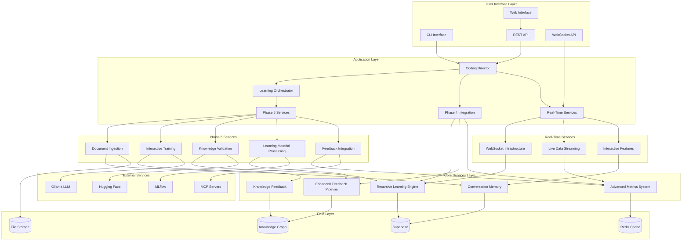
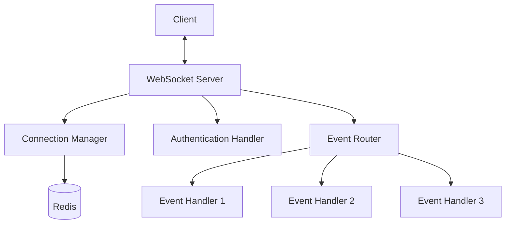
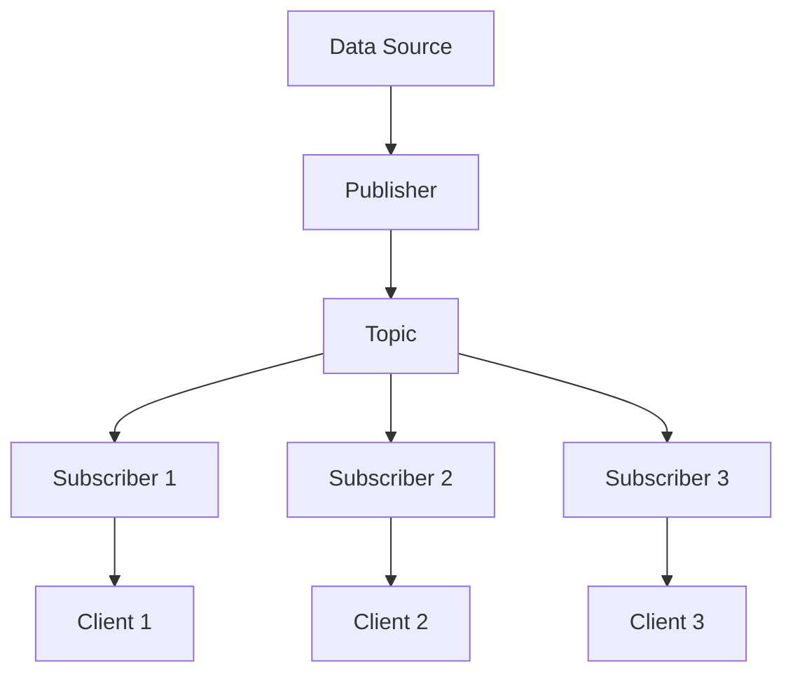
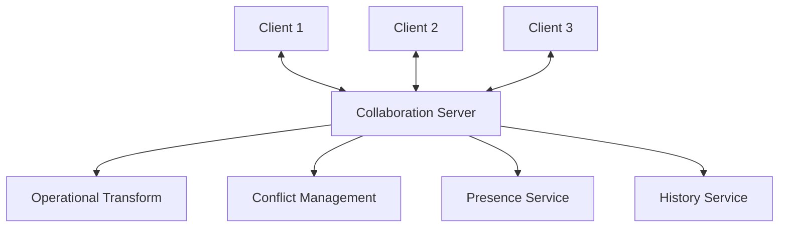
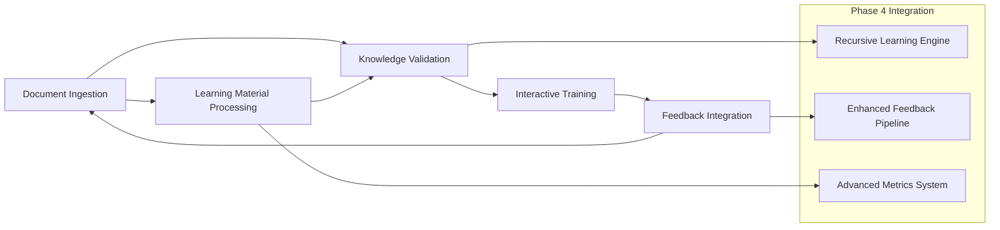

# System Patterns - Enhanced Elite Coding Assistant Architecture

## System Architecture Overview

The Enhanced Elite Coding Assistant follows a layered, microservices-based architecture with event-driven communication, recursive learning capabilities, and real-time features.



## Key Technical Decisions

### 1. Microservices Architecture

**Decision**: Implement Phase 5 components and Real-Time Services as loosely coupled microservices

**Rationale**:
- Independent scaling and deployment
- Technology diversity (different services can use optimal tech stacks)
- Fault isolation and resilience
- Team autonomy and parallel development
- Real-time services can scale independently based on connection load

## Real-Time Features Architecture

### 1. WebSocket Infrastructure

**Pattern**: Event-driven WebSocket server with connection management



**Implementation**:
```python
class WebSocketManager:
    def __init__(self):
        self.active_connections: Dict[str, WebSocket] = {}
        self.connection_metadata: Dict[str, Dict] = {}
        self.event_handlers: Dict[str, Callable] = {}
        
    async def connect(self, websocket: WebSocket, client_id: str):
        await websocket.accept()
        self.active_connections[client_id] = websocket
        self.connection_metadata[client_id] = {"connected_at": datetime.now()}
        
    async def disconnect(self, client_id: str):
        if client_id in self.active_connections:
            del self.active_connections[client_id]
            del self.connection_metadata[client_id]
            
    async def broadcast(self, message: dict):
        for connection in self.active_connections.values():
            await connection.send_json(message)
            
    async def send_personal_message(self, client_id: str, message: dict):
        if client_id in self.active_connections:
            await self.active_connections[client_id].send_json(message)
```

### 2. Live Data Streaming

**Pattern**: Publisher-Subscriber model with real-time data processing



**Implementation**:
```python
class LiveDataStream:
    def __init__(self, topic: str):
        self.topic = topic
        self.subscribers: List[Callable] = []
        
    def subscribe(self, callback: Callable):
        self.subscribers.append(callback)
        
    def unsubscribe(self, callback: Callable):
        if callback in self.subscribers:
            self.subscribers.remove(callback)
            
    async def publish(self, data: Any):
        for subscriber in self.subscribers:
            await subscriber(data)
```

### 3. Interactive Features

**Pattern**: Collaborative workspace with real-time synchronization



**Implementation**:
```python
class CollaborationSession:
    def __init__(self, session_id: str):
        self.session_id = session_id
        self.participants: Dict[str, WebSocket] = {}
        self.document_state: Dict = {}
        self.operations_history: List[Dict] = []
        
    async def join(self, user_id: str, websocket: WebSocket):
        await websocket.accept()
        self.participants[user_id] = websocket
        await self.broadcast_presence_update()
        await self.send_current_state(user_id)
        
    async def leave(self, user_id: str):
        if user_id in self.participants:
            del self.participants[user_id]
            await self.broadcast_presence_update()
            
    async def apply_operation(self, user_id: str, operation: Dict):
        # Apply operational transform
        transformed_op = self.transform_operation(operation)
        self.apply_to_document(transformed_op)
        self.operations_history.append(transformed_op)
        await self.broadcast_operation(user_id, transformed_op)
```

**Implementation Pattern**:
```python
# Service base class pattern
class BaseService:
    def __init__(self, config: ServiceConfig):
        self.config = config
        self.event_bus = EventBus()
        self.metrics = MetricsCollector()
        
    async def start(self):
        await self.initialize()
        await self.register_handlers()
        
    async def stop(self):
        await self.cleanup()
```

### 2. Event-Driven Communication

**Decision**: Use event-driven architecture for inter-service communication

**Rationale**:
- Loose coupling between services
- Asynchronous processing capabilities
- Easy to add new services and handlers
- Natural fit for learning and feedback loops

**Implementation Pattern**:
```python
# Event system pattern
class EventBus:
    def __init__(self):
        self.handlers = defaultdict(list)
        
    def subscribe(self, event_type: str, handler: Callable):
        self.handlers[event_type].append(handler)
        
    async def publish(self, event: Event):
        for handler in self.handlers[event.type]:
            await handler(event)
```

### 3. Plugin-Based Extension System

**Decision**: Implement extensible plugin system for document processors and validators

**Rationale**:
- Easy to add support for new document formats
- Third-party extensions possible
- Maintainable and testable code
- Clear separation of concerns

**Implementation Pattern**:
```python
# Plugin system pattern
class DocumentProcessor(ABC):
    @abstractmethod
    def can_process(self, file_path: str) -> bool:
        pass
        
    @abstractmethod
    async def process(self, file_path: str) -> ProcessedDocument:
        pass

class ProcessorRegistry:
    def __init__(self):
        self.processors = []
        
    def register(self, processor: DocumentProcessor):
        self.processors.append(processor)
        
    def get_processor(self, file_path: str) -> DocumentProcessor:
        for processor in self.processors:
            if processor.can_process(file_path):
                return processor
        raise UnsupportedFormatError()
```

### 4. Async-First Design

**Decision**: Use asyncio throughout the system for all I/O operations

**Rationale**:
- Better resource utilization
- Improved scalability
- Non-blocking operations
- Consistent with existing codebase

**Implementation Pattern**:
```python
# Async service pattern
class AsyncService:
    async def __aenter__(self):
        await self.start()
        return self
        
    async def __aexit__(self, exc_type, exc_val, exc_tb):
        await self.stop()
        
    async def process_batch(self, items: List[Any]) -> List[Result]:
        tasks = [self.process_item(item) for item in items]
        return await asyncio.gather(*tasks)
```

## Design Patterns in Use

### 1. Repository Pattern

**Usage**: Data access abstraction for knowledge storage

```python
class KnowledgeRepository(ABC):
    @abstractmethod
    async def store_knowledge(self, knowledge: Knowledge) -> str:
        pass
        
    @abstractmethod
    async def retrieve_knowledge(self, query: Query) -> List[Knowledge]:
        pass
        
    @abstractmethod
    async def update_knowledge(self, id: str, updates: Dict) -> bool:
        pass
```

### 2. Strategy Pattern

**Usage**: Different validation strategies for different content types

```python
class ValidationStrategy(ABC):
    @abstractmethod
    async def validate(self, content: Content) -> ValidationResult:
        pass

class TechnicalDocumentValidator(ValidationStrategy):
    async def validate(self, content: Content) -> ValidationResult:
        # Technical document specific validation
        pass

class CodeSnippetValidator(ValidationStrategy):
    async def validate(self, content: Content) -> ValidationResult:
        # Code snippet specific validation
        pass
```

### 3. Observer Pattern

**Usage**: Learning progress tracking and metrics collection

```python
class LearningObserver(ABC):
    @abstractmethod
    async def on_learning_event(self, event: LearningEvent):
        pass

class MetricsObserver(LearningObserver):
    async def on_learning_event(self, event: LearningEvent):
        await self.metrics.record(event)

class FeedbackObserver(LearningObserver):
    async def on_learning_event(self, event: LearningEvent):
        await self.feedback_pipeline.process(event)
```

### 4. Factory Pattern

**Usage**: Creating appropriate processors and validators

```python
class ProcessorFactory:
    @staticmethod
    def create_processor(file_type: str) -> DocumentProcessor:
        processors = {
            'pdf': PDFProcessor,
            'docx': DocxProcessor,
            'md': MarkdownProcessor,
            'txt': TextProcessor
        }
        processor_class = processors.get(file_type)
        if not processor_class:
            raise UnsupportedFormatError(f"No processor for {file_type}")
        return processor_class()
```

## Component Relationships

### Phase 5 Service Dependencies



### Data Flow Patterns

1. **Document Ingestion Flow**:
   ```
   Upload → Format Detection → Processing → Extraction → Validation → Storage → Indexing
   ```

2. **Training Interaction Flow**:
   ```
   User Input → Context Loading → Response Generation → Feedback Collection → Learning Update
   ```

3. **Knowledge Validation Flow**:
   ```
   New Knowledge → Conflict Detection → Accuracy Check → Quality Scoring → Approval/Rejection
   ```

4. **Feedback Integration Flow**:
   ```
   Feedback → Classification → Impact Analysis → Learning Adjustment → Performance Measurement
   ```

## Error Handling and Resilience

### Circuit Breaker Pattern

```python
class CircuitBreaker:
    def __init__(self, failure_threshold: int = 5, timeout: int = 60):
        self.failure_threshold = failure_threshold
        self.timeout = timeout
        self.failure_count = 0
        self.last_failure_time = None
        self.state = 'CLOSED'  # CLOSED, OPEN, HALF_OPEN
        
    async def call(self, func: Callable, *args, **kwargs):
        if self.state == 'OPEN':
            if time.time() - self.last_failure_time > self.timeout:
                self.state = 'HALF_OPEN'
            else:
                raise CircuitBreakerOpenError()
                
        try:
            result = await func(*args, **kwargs)
            if self.state == 'HALF_OPEN':
                self.state = 'CLOSED'
                self.failure_count = 0
            return result
        except Exception as e:
            self.failure_count += 1
            self.last_failure_time = time.time()
            if self.failure_count >= self.failure_threshold:
                self.state = 'OPEN'
            raise e
```

### Retry Pattern with Exponential Backoff

```python
class RetryHandler:
    @staticmethod
    async def retry_with_backoff(
        func: Callable,
        max_retries: int = 3,
        base_delay: float = 1.0,
        max_delay: float = 60.0,
        exponential_base: float = 2.0
    ):
        for attempt in range(max_retries + 1):
            try:
                return await func()
            except Exception as e:
                if attempt == max_retries:
                    raise e
                    
                delay = min(
                    base_delay * (exponential_base ** attempt),
                    max_delay
                )
                await asyncio.sleep(delay)
```

## Performance Optimization Patterns

### Caching Strategy

```python
class CacheManager:
    def __init__(self, redis_client):
        self.redis = redis_client
        
    async def get_or_compute(
        self,
        key: str,
        compute_func: Callable,
        ttl: int = 3600
    ):
        # Try cache first
        cached = await self.redis.get(key)
        if cached:
            return json.loads(cached)
            
        # Compute and cache
        result = await compute_func()
        await self.redis.setex(key, ttl, json.dumps(result))
        return result
```

### Batch Processing Pattern

```python
class BatchProcessor:
    def __init__(self, batch_size: int = 100, max_wait: float = 5.0):
        self.batch_size = batch_size
        self.max_wait = max_wait
        self.queue = asyncio.Queue()
        self.processing_task = None
        
    async def add_item(self, item: Any):
        await self.queue.put(item)
        if not self.processing_task or self.processing_task.done():
            self.processing_task = asyncio.create_task(self._process_batch())
            
    async def _process_batch(self):
        batch = []
        deadline = time.time() + self.max_wait
        
        while len(batch) < self.batch_size and time.time() < deadline:
            try:
                item = await asyncio.wait_for(
                    self.queue.get(),
                    timeout=deadline - time.time()
                )
                batch.append(item)
            except asyncio.TimeoutError:
                break
                
        if batch:
            await self._process_items(batch)
```

## Security Patterns

### Input Validation and Sanitization

```python
class InputValidator:
    @staticmethod
    def validate_file_upload(file_data: bytes, filename: str) -> bool:
        # File size validation
        if len(file_data) > 50 * 1024 * 1024:  # 50MB limit
            raise FileTooLargeError()
            
        # File type validation
        allowed_extensions = {'.pdf', '.docx', '.txt', '.md', '.html'}
        if not any(filename.lower().endswith(ext) for ext in allowed_extensions):
            raise UnsupportedFileTypeError()
            
        # Content validation (basic)
        try:
            file_data.decode('utf-8', errors='ignore')
        except Exception:
            pass  # Binary files are OK
            
        return True
```

### Access Control Pattern

```python
class AccessControl:
    def __init__(self, permissions_service):
        self.permissions = permissions_service
        
    def require_permission(self, permission: str):
        def decorator(func):
            @wraps(func)
            async def wrapper(*args, **kwargs):
                user = kwargs.get('user') or args[0] if args else None
                if not await self.permissions.has_permission(user, permission):
                    raise PermissionDeniedError()
                return await func(*args, **kwargs)
            return wrapper
        return decorator
```